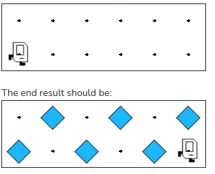

### Question # 03
Karel will be in a blank world at the bottom left corner. Karel should place a zig zag pattern of beepers such that all odd columns have beepers in row 1 and all even columns have beepers in row 2. The world will always have 2 rows and an even number of columns. Karel should end up in the bottom right corner of the world.

For example, if Karel starts in a blank world with 2 rows and 6 columns, like so:



## Answer
```python
"""
This is a worked example. This code is starter code; you should edit and run it to 
solve the problem. You can click the blue show solution button on the left to see 
the answer if you get too stuck or want to check your work!
"""

from karel.stanfordkarel import *

def main():
    """
    Places beepers in a zig zag pattern.
    """
    while front_is_clear():  # We don't know how large the world is, so use a while-loop when moving
        zig_one_zag()  # Place a single diagonal pair of beepers (one zigzag)
        move_to_next_zigzag_spot()  # Move to the next spot where we need to place a zigzag

def zig_one_zag():
    """
    Places two beepers at a time. Karel starts facing East in row 1, and Karel will end in row 2.
    If both beepers can be placed (Karel doesn't start facing a wall), Karel will end up one column greater than where Karel started. If not, Karel will be in the same column as initially.
    
    Pre: Karel is on row 1 facing East.
    Post: Karel is on row 2 facing East, one column to the right if possible
    """
    put_beeper()
    turn_left()  # Face North
    move()  # Move up to row 2
    turn_right()  # Face East
    if front_is_clear(): # If we remove this check, the code will work, but only on even-column-numbered worlds
        # Only place second beeper if Karel isn't already at the rightmost column of the world
        move()
        put_beeper()

def turn_right():
    for i in range(3):
        turn_left()
        
def move_to_next_zigzag_spot():
    """
    Moves Karel to the next spot to perform zig_one_zag(). Karel starts facing East in row 2, and will end up in row 1.
    If Karel is not facing a wall, Karel will end up one column greater than where Karel started. Otherwise, Karel will be in the same column as initially.
    """
    turn_right()  # Face South
    move()  # Move down to row 1
    turn_left()  # Face East
    if front_is_clear():  # Move to next column if possible
        move()


# There is no need to edit code beyond this point

if __name__ == '__main__':
    main()
```