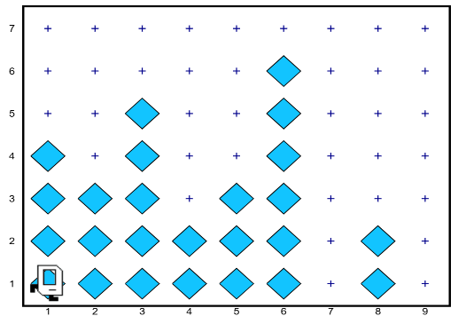

## Chapter 8: Stepwise Refinement
To combat this problem, programmers began to develop a set of programming methodologies that are collectively called **software engineering.**

One of the most important methodological advances to come out of software engineering is the strategy of **top-down design** or **stepwise refinement**, which consists of solving problems by starting with the problem as a whole. You break the whole problem down into pieces, and then solve each piece, breaking those down further if necessary. This top down strategy is complemented with **iterative testing** where you make sure that the smaller pieces of the solution are working before moving on.

### The principle of top-down design
The key idea in stepwise refinement is that you should start the design of your program from the top, which refers to the level of the program that is conceptually highest and most abstract. 

At this level, the beeper tower problem is clearly divided into three independent phases. 
* First, Karel has to collect all the beepers. 
* Second, Karel has to deposit them on the last intersection. 
* Third, Karel has to return to its home position. This conceptual decomposition of the problem suggests that the main() function for this program will have the following structure:

```python
   def main():
      collect_all_beepers()
      drop_all_beepers()
      return_home()
```

### Iterative testing as you go
```python
def collect_all_beepers() :
      # temporary implementation for testing purposes
      collect_one_tower()
      move()
```

As a guiding principle, if you have a complex loop, test the body of the loop before you write the entire loop.

### Refining collect tower
When collect_one_tower() is called, Karel is either standing at the base of a tower of beepers or standing on an empty corner. In the former case, you need to collect the beepers in the tower. In the latter, you can simply move on. This situation sounds like an application for the if statement, in which you would write something like this:

```python
   if beepers_present():
      collect_actual_tower()
```

The `collect_one_tower()` function is still complex enough that an additional level of decomposition is in order. \
To collect all the beeper s in a tower, Karel needs to undertake the following steps:

* Turn left to face the beepers in the tower.
* Collect all the beepers in the tower, stopping when no more beepers are found.
* Turn around to face back toward the bottom of the world.
* Return to the wall that represents the ground.
* Turn left to be ready to move to the next corner.

Once again, this outline provides a model for the `collect_one_tower()` function, which looks like this:

```python
   def collect_one_tower():
      turn_left()
      collect_line_of_beepers()
      turn_around()
      move_to_wall()
      turn_left()
```

## Function preconditions and postconditions
The **turn_left()** commands at the beginning and end of the **collect_one_tower()** function are both critical to the correctness of this program. When **collect_one_tower()** is called, Karel is always somewhere on 1st row facing east. When it completes its operation, the program as a whole will work correctly only if Karel is again facing east at that same corner. Conditions that must be true before a function is called are referred to as **preconditions**; conditions that must apply after the function finishes are known as **postconditions.**

## Repeating the process
```python
def collect_all_beepers():
      # buggy loop!
      while front_is_clear():
         collect_one_tower()
         move()
```

This implementation is buggy for exactly the same reason that the first version of the general **BeeperLine program**
 
#### Correct program
```python
def collect_all_beepers():
      while frontIsClear():
         collect_one_tower()
         move()
      collect_one_tower()
```

## Example
```python
# File: BeeperCollectingKarel.py
# --------------------------------
# The BeeperCollectingKarel class collects all the beepers
# in a series of vertical towers and deposits them at the
# eastmost corner on 1st row.
from karel.stanfordkarel import *

def main():
   collect_all_beepers()
   drop_all_beepers()
   return_home()

# Collects the beepers from every tower by moving along 1st
# row, calling collect_one_tower at every corner.  The
# postcondition for this function is that Karel is in the
# easternmost corner of 1st row facing east.
def collect_all_beepers():
   while front_is_clear():
      collect_one_tower()
      move()
   collect_one_tower()

# Collects the beepers in a single tower. When collect_one_tower
# is called, Karel must be on 1st row facing east.  The
# postcondition for collect_one_tower is that Karel must again
# be facing east on that same corner.
def collect_one_tower():
   turn_left()
   collect_line_of_beepers()
   turn_around()
   move_to_wall()
   turn_left()

# Collects a consecutive line of beepers. The end of the beeper
# line is indicated by a corner that contains no beepers.
def collect_line_of_beepers():
   while beepers_present():
      pick_beeper()
      if front_is_clear():
         move()

# Drops all the beepers on the current corner.
def drop_all_beepers() :
   while beepers_in_bag():
      put_beeper()

# Returns Karel to its initial position at the corner of 1st
# Avenue and 1st row, facing east.  The precondition for this
# function is that Karel must be facing east somewhere on 1st
# row, which is true at the conclusion of collect_all_beepers.
def return_home():
   turn_around()
   move_to_wall()
   turn_around()

# Moves Karel forward until it is blocked by a wall.
def move_to_wall():
   while front_is_clear():
      move()

# Turns Karel 180 degrees around
def turn_around():
   turn_left()
   turn_left()
```

## Answer

