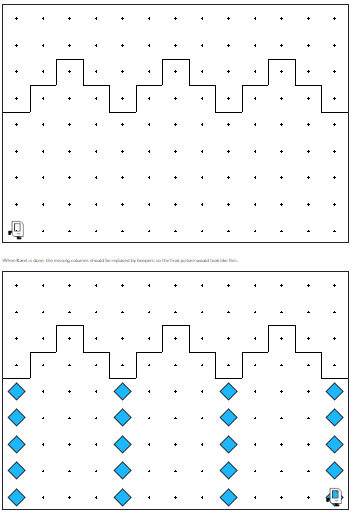

## Assignment
Karel has been hired to build the columns in the Temple of Artemis in Efes. In particular, there are a set of arches where the stones (represented by beepers, of course) are missing from the columns supporting the arches, as follows:

When Karel is done, the missing columns should be replaced by beepers, so the final picture would look like second image:



Karel may count on the following facts about the world, listed below:
* Karel starts at bottom left corner, facing right (aka east).
* The columns are exactly four squares apart, on the 1st, 5th, 9th, and 13th columns.
* Karel can assume that columns are always five units high.

## Answer
```python
from karel.stanfordkarel import *

"""
File: main.py
--------------------
Karel repairs each of the columns in the temple.
Karel starts at the bottom-left, facing east.
Each column is 5 units high and 4 units apart.
"""

def main():
    while front_is_clear():
        repair_column()
        move_to_next_column()
    # After loop, repair last column
    repair_column()

def repair_column():
    turn_left()  # Face north
    for i in range(5):
        if no_beepers_present():
            put_beeper()
        if front_is_clear():
            move()
    turn_around()
    for i in range(4):
        move()
    turn_left()  # Face east

def move_to_next_column():
    for i in range(4):
        if front_is_clear():
            move()

def turn_around():
    turn_left()
    turn_left()

if __name__ == '__main__':
    main()
```