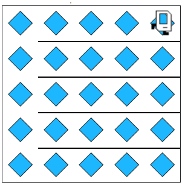
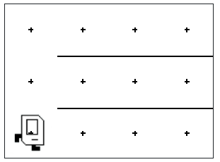
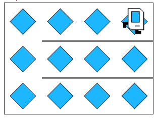

## Assignment
Your task is simple: no matter the size of the world, Karel should fill it with beepers.

For example, consider Karel's starting 5x5 world. When complete it should look like this:


Note that Karel's final position does matter. Karel should be in the top-right corner facing right. You can assume that Karel always starts in the bottom-left corner, facing right. Your code needs to work on more than just a 5x5 world. For example if you run your solution on the 3x4 world.



The result should still be a world filled with beepers:


Notice the walls! Each world will have similar walls, blocking Karel from moving up rows, except for on the first column. 

## Answer
```python
from karel.stanfordkarel import *

"""
Karel should fill the whole world with beepers.
"""


def main():
    """
    You should write your code to make Karel do its task in
    this function. Make sure to delete the 'pass' line before
    starting to write your own code. You should also delete this
    comment and replace it with a better, more descriptive one.
    """
    while left_is_clear():
        fill_row()
        return_to_start()
        move_up()
    # Fill the final row after Karel can no longer move up
    fill_row()

def fill_row():
    put_beeper()
    while front_is_clear():
        move()
        put_beeper()

def return_to_start():
    turn_around()
    while front_is_clear():
        move()
    turn_around()

def move_up():
    turn_left()
    move()
    turn_right()

def turn_around():
    turn_left()
    turn_left()

def turn_right():
    turn_left()
    turn_left()
    turn_left()


# There is no need to edit code beyond this point
if __name__ == '__main__':
    main()
```