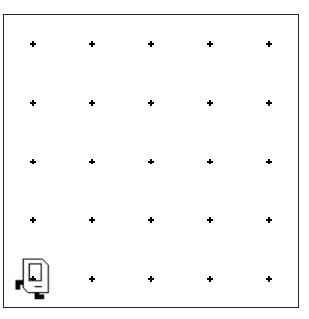
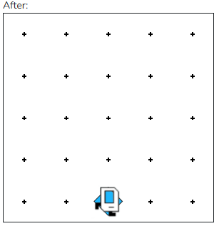

## Assignment
Assignment
As an exercise in solving algorithmic problems, you will program to find the midpoint of 1st Street. Say Karel starts in the 5x5 world. Karel should end in the center of 1st row.

Before:


After:


Note that the final configuration of the world should have only a single beeper at the midpoint of the 1st row. Along the way, Karel is allowed to place additional beepers wherever it wants to, but must pick them all up again before it finishes. Similarly, if Karel paints/colors any of the corners in the world, they must all be uncolored before Karel finishes.

In solving this problem, you may count on the following facts about the world:

* Karel starts at bottom left corner of the world, facing east.
* The initial state of the world includes no interior walls or beepers.
* The world need not be square, but you may assume that it is at least as tall as it is wide.
* If the width of the world is odd, Karel must put the beeper in the center square. If the width is even, Karel must drop a beeper on the left most of the two squares.

```python
from karel.stanfordkarel import *

"""
File: main.py
--------------------
When you finish writing this file, Karel should be able to find
the midpoint
"""

def main():
    """
    You should write your code to make Karel do its task in
    this function. Make sure to delete the 'pass' line before
    starting to write your own code. You should also delete this
    comment and replace it with a better, more descriptive one.
    """
    pass

if __name__ == '__main__':
    main()
```

## Answer 
```python
from karel.stanfordkarel import *

def main():
    ###
    while front_is_clear() and no_beepers_present():
        move()
    put_beeper()
    turn_back()

    while front_is_clear() and no_beepers_present():
        move()
    put_beeper()
    turn_back()
    ###
    
    while no_beepers_present():
        cycle_A()
    
    pick_beeper()
    turn_back()
    turn_left()
    turn_left()
    if facing_west():
        turn_left()
        turn_left()


#FUNCTIONS:
def turn_back():
    turn_left()
    turn_left()
    move()

def cycle_A():

    while front_is_clear() and no_beepers_present():
        move()
    pick_beeper()
    turn_back()
    put_beeper()
    move()

if __name__ == '__main__':
    main()
```