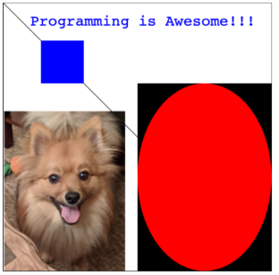

## Practice Question # 01 
This program demonstrates how to draw using python graphics. It showcases drawing:\
lines, rectangles, ovals, text and images



### Given Code
```python
"""
This is a worked example. This code is starter code; you should edit and run it to 
solve the problem. You can click the blue show solution button on the left to see 
the answer if you get too stuck or want to check your work!

Note: The starter code for this example is the solution.
"""

from graphics import Canvas
import time

CANVAS_WIDTH = 500
CANVAS_HEIGHT = 500

def main():
    canvas = Canvas(CANVAS_WIDTH, CANVAS_HEIGHT)

    # Draws a line for good measure!
    canvas.create_line(0, 0, 500, 500)

    # Draws a blue square with width and height = 80
    canvas.create_rectangle(70, 70, 150, 150, "blue")

    # Draws a red oval and a rectangle at the exact same spot!
    canvas.create_rectangle(250, 150, 500, 500)
    canvas.create_oval     (250, 150, 500, 500, "red")

    # Images require the Pillow library, but we handle that for you
    canvas.create_image(0, 200, "simba.png")

    # Some text is written on the screen.
    canvas.create_text(50, 20, 
        "Programming is Awesome!!!", 
        color="blue", 
        font="Courier", 
        font_size=28)

    # Dude, where's my rect?
    canvas.create_rectangle(0, 800, 10, 810)
    
    # This is just for demo purposes :P
    show_mouse_position(canvas)
    
def show_mouse_position(canvas):
    """
    Warning: you can ignore this code. I just included
    it for demo purposes. It continually asks for the
    users mouse location and prints the location to the
    terminal.
    """
    while True:
        x = canvas.get_mouse_x()
        y = canvas.get_mouse_y()
        # This is an fstring, which is a fancy way to 
        # combine numbers and strings; how handy!
        print(f"x = {x}, y = {y}")
        time.sleep(1/50)

if __name__ == '__main__':
    main()
```

## Answer
```python
```