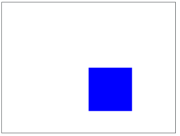
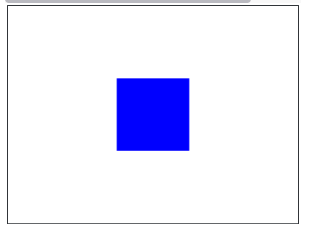

## Practice Question # 02
Write a program that draws a square, 200 pixels wide, by 200 pixels high, right in the center of the canvas. Warning: this example involves a little math. But it is math worth knowing!

This program is hard, because the first attempt that most students try does not work. It is tempting to try to place the square in the middle by setting the first two parameters of create_rectangle to be middle_x and middle_y:

```python
middle_x = CANVAS_WIDTH / 2
middle_y = CANVAS_HEIGHT / 2
    
# Calculate the right and bottom of the square
right_x = middle_x + SQUARE_SIZE
bottom_y = middle_y + SQUARE_SIZE
    
# Draw the square
canvas.create_rectangle(middle_x, middle_y, right_x, bottom_y, 'blue')
```

However, instead of putting the square in the middle, this puts the top left corner of the square in the middle of the canvas.


Oops. We need to subtract a few pixels from the first two coordinates. How many? exactly half the size of the square in either direction. This code works correctly:

```python
# Get the middle of the canvas
middle_x = CANVAS_WIDTH / 2
middle_y = CANVAS_HEIGHT / 2
    
# Calculate the top left corner position
left_x = middle_x - SQUARE_SIZE / 2
top_y = middle_y - SQUARE_SIZE / 2
    
# Calculate the right and bottom of the square
right_x = left_x + SQUARE_SIZE
bottom_y = top_y + SQUARE_SIZE
```



### Given Code
```python
"""
This is a worked example. This code is starter code; you should edit and run it to 
solve the problem. You can click the blue show solution button on the left to see 
the answer if you get too stuck or want to check your work!

Note: The starter code for this example is the solution.
"""

from graphics import Canvas

CANVAS_WIDTH = 400
CANVAS_HEIGHT = 300
SQUARE_SIZE = 100

def main():
    canvas = Canvas(CANVAS_WIDTH, CANVAS_HEIGHT)
    
    # Get the middle of the canvas
    middle_x = CANVAS_WIDTH/2
    middle_y = CANVAS_HEIGHT/2
    
    # Calculate the top left corner position
    left_x = middle_x - SQUARE_SIZE/2
    top_y = middle_y - SQUARE_SIZE/2
    
    # Calculate the right and bottom of the square
    right_x = left_x + SQUARE_SIZE
    bottom_y = top_y + SQUARE_SIZE
    
    # Draw the square
    canvas.create_rectangle(left_x, top_y, right_x, bottom_y, 'blue')

if __name__ == '__main__':
    main()
```

## Answer
```python
```