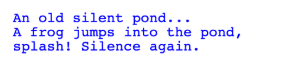

## Haiku
A haiku is a kind of poem which is comprised of 3 lines of 5, 7, and 5 syllables respectively. Here's a famous haiku, “An Old Silent Pond” by Bashō:
```
An old silent pond...  
A frog jumps into the pond,  
splash! Silence again.
```

Write this haiku onto the screen in three lines, in the font 'Courier'. The lines of text should all be aligned on the left side but not overlap each other, so that the output looks like this:



### Given Code
```python
"""
This is a worked example. This code is starter code; you should edit and run it to 
solve the problem. You can click the blue show solution button on the left to see 
the answer if you get too stuck or want to check your work!
"""

from graphics import Canvas

CANVAS_WIDTH = 500
CANVAS_HEIGHT = 500
FIRST_LINE_LEFT_X = 50
FIRST_LINE_TOP_Y = 50
FONT_SIZE = 24

def main():
	canvas = Canvas(CANVAS_WIDTH, CANVAS_HEIGHT)
	
	pass # Delete this line and write your code here! :)


# There is no need to edit code beyond this point

if __name__ == '__main__':
    main()
```

## Answer
```python
from graphics import Canvas

CANVAS_WIDTH = 500
CANVAS_HEIGHT = 500
FIRST_LINE_LEFT_X = 50
FIRST_LINE_TOP_Y = 50
FONT_SIZE = 24

def main():
    canvas = Canvas(CANVAS_WIDTH, CANVAS_HEIGHT)
    
    # Create first line of text using the constants above
    canvas.create_text(FIRST_LINE_LEFT_X, FIRST_LINE_TOP_Y, 
        "An old silent pond...", 
        color="blue", 
        font="Courier", 
        font_size=FONT_SIZE)
    
    # Create the second line of text, moved down by one font size
    canvas.create_text(FIRST_LINE_LEFT_X, FIRST_LINE_TOP_Y + FONT_SIZE, 
        "A frog jumps into the pond,", 
        color="blue", 
        font="Courier", 
        font_size=FONT_SIZE)

    # Create the third line, moved down by two font sizes
    canvas.create_text(FIRST_LINE_LEFT_X, FIRST_LINE_TOP_Y + 2 * FONT_SIZE, 
        "splash! Silence again.", 
        color="blue", 
        font="Courier", 
        font_size=FONT_SIZE)

# No need to edit below this point
if __name__ == '__main__':
    main()
```