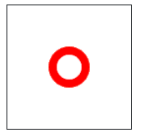
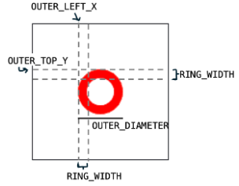

## Ring ring!
## Assignment
We can combine shapes to make new ones! To practice this, make a red ring, as shown below.



This can be done by drawing two overlapping ovals. You can make one outer oval (in red), and then one smaller, inner oval (in white) inside of the first oval! Since the background is white, this gives the appearance of a ring. We've provided some constants to help you with the dimensions and location of the rings. 

First, draw the outer oval. Its top left corner should be at OUTER_LEFT_X, OUTER_TOP_Y. Use the OUTER_DIAMETER constant to determine the outer oval's right x and bottom y. As a reminder: the diameter of a circle is the same as the maximum width and the maximum height of the circle!


Next, the inner white oval should be centered inside of that outer red. To do this, shift all four coordinates by RING_WIDTH pixels towards the center of the canvas.

Here is a diagram explaining some of the constants: 



### Given Code
```python
from graphics import Canvas

CANVAS_WIDTH = 150
CANVAS_HEIGHT = 150

# the diameter of the outer red circle
OUTER_DIAMETER = 50

# the left and top corrdinates of the outer red circle
OUTER_LEFT_X = (CANVAS_WIDTH - OUTER_DIAMETER)/2
OUTER_TOP_Y = (CANVAS_HEIGHT - OUTER_DIAMETER)/2

# the size of the red band of the ring
# inner_left_x = outer_left_x + RING_WIDTH
RING_WIDTH = 10


def main():
    canvas = Canvas(CANVAS_WIDTH, CANVAS_HEIGHT)
    
    # your code here!
    
    


# There is no need to edit code beyond this point
if __name__ == '__main__':
    main()
```

## Answer
```python
from graphics import Canvas

CANVAS_WIDTH = 150
CANVAS_HEIGHT = 150

# The diameter of the outer red circle
OUTER_DIAMETER = 50

# The left and top coordinates of the outer red circle
OUTER_LEFT_X = (CANVAS_WIDTH - OUTER_DIAMETER) / 2
OUTER_TOP_Y = (CANVAS_HEIGHT - OUTER_DIAMETER) / 2

# The size of the red band of the ring
RING_WIDTH = 10

def main():
    canvas = Canvas(CANVAS_WIDTH, CANVAS_HEIGHT)

    # Outer red oval
    canvas.create_oval(
        OUTER_LEFT_X, 
        OUTER_TOP_Y, 
        OUTER_LEFT_X + OUTER_DIAMETER, 
        OUTER_TOP_Y + OUTER_DIAMETER, 
        "red"
    )

    # Inner white oval (creates the ring effect)
    canvas.create_oval(
        OUTER_LEFT_X + RING_WIDTH,
        OUTER_TOP_Y + RING_WIDTH,
        OUTER_LEFT_X + OUTER_DIAMETER - RING_WIDTH,
        OUTER_TOP_Y + OUTER_DIAMETER - RING_WIDTH,
        "white"
    )

# No need to edit below this line
if __name__ == '__main__':
    main()
```