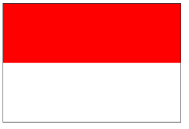

## Assignment
Students in Code in Place are from 150 different countries! Wow. Let's celebrate our international class by drawing flags. To start out, one of the most straightforward flags to draw using Python graphics is the flag of Indonesia:



The dimensions of your flag should be based off the provided constants:

```python
# The width of the canvas
CANVAS_WIDTH = 450
# The height of the canvas
CANVAS_HEIGHT = 300
```

To draw the Indonesian flag all you need to do is to draw a single red rectangle which covers the top half of the graphics canvas. You don't need to draw the white stripe, the canvas is white by default.

Recall the graphics method for drawing a colored rectangle:

```python
# Draws a rectangle with specified color
rect = canvas.create_rectangle(
    left_x, 
    top_y, 
    right_x, 
    bottom_y,
    color
)
```

### Given Code
```python
from graphics import Canvas
import random

CANVAS_WIDTH = 450
CANVAS_HEIGHT = 300

def main():
    canvas = Canvas(CANVAS_WIDTH, CANVAS_HEIGHT)
    # TODO, your code here
    

if __name__ == '__main__':
    main()
```

## Answer
```python
from graphics import Canvas

CANVAS_WIDTH = 450
CANVAS_HEIGHT = 300

def main():
    canvas = Canvas(CANVAS_WIDTH, CANVAS_HEIGHT)
    
    # Coordinates for the red top half
    left_x = 0
    top_y = 0
    right_x = CANVAS_WIDTH
    bottom_y = CANVAS_HEIGHT / 2  # Half the height

    # Draw the red rectangle
    canvas.create_rectangle(left_x, top_y, right_x, bottom_y, 'red')

if __name__ == '__main__':
    main()
```
