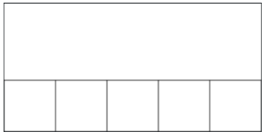

## Assignment
Let's practice making graphics with lots of repeated elements. This will help us get familiar with working with multiple shapes and pixel calculations!

Make a line of boxes as shown below, such that the boxes fill the bottom of the canvas. Each box should have a width and height of BOX_SIZE, making a total of 5 boxes perfectly in line with one another:



To make each individual box visible instead of making a single rectangular box, add optional arguments to your `create_rectangle(...)` call. The first optional argument is the fill color (in this case "white") and the second optional argument is the outline color (in this case `"black"`). Calling the function when you add these should look like this:

```python
# Creates a white rectangle 
# with a black outline
canvas.create_rectangle(
    left_x, 
    top_y, 
    right_x, 
    bottom_y, 
    "white", 
    "black"
)
```

You should use a for loop to create your row. As an aside: it is possible to solve this problem without a for loop, but that would defeat the point of the assignment!

```python
for i in range(N_BOXES):
```

The most elegant solution is to use the value of i to compute the left_x of the current box.

### Given Code
```python
from graphics import Canvas

CANVAS_WIDTH = 400
CANVAS_HEIGHT = 200
N_BOXES = 5
BOX_SIZE = CANVAS_WIDTH / N_BOXES

def main():
    canvas = Canvas(CANVAS_WIDTH, CANVAS_HEIGHT)
    
    pass # Delete this line and write your code here! :)


# There is no need to edit code beyond this point

if __name__ == '__main__':
    main()
```

## Answer
```python
from graphics import Canvas

CANVAS_WIDTH = 400
CANVAS_HEIGHT = 200
N_BOXES = 5
BOX_SIZE = CANVAS_WIDTH / N_BOXES

def main():
    canvas = Canvas(CANVAS_WIDTH, CANVAS_HEIGHT)

    for i in range(N_BOXES):
        left_x = i * BOX_SIZE
        top_y = CANVAS_HEIGHT - BOX_SIZE  # align to bottom
        right_x = left_x + BOX_SIZE
        bottom_y = CANVAS_HEIGHT

        canvas.create_rectangle(left_x, top_y, right_x, bottom_y, "white", "black")

if __name__ == '__main__':
    main()
```
