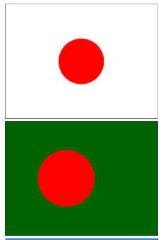
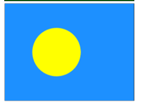

## Flags with Parameters
What generalizable function would you define to draw the dots in these three flags?




The most useful function would be which can draw a circle of a given size at a given location

```python
def draw_circle(canvas, center_x, center_y, size, color):
    """
    Draws a circle on the given canvas. The circle will have its center
    at center_x, center_y. It will be size pixels tall and size pixels wide.
    """
```

### Given Code
```python
"""
This is a worked example. This code is starter code; you should edit and run it to 
solve the problem. You can click the blue show solution button on the left to see 
the answer if you get too stuck or want to check your work!

Note: The starter code for this example is the solution.
"""

from graphics import Canvas

CANVAS_WIDTH = 400
CANVAS_HEIGHT = 300

def main():
    canvas = Canvas(CANVAS_WIDTH, CANVAS_HEIGHT)
    draw_japan_flag(canvas)
    canvas.wait_for_click()
    
    draw_bangladesh_flag(canvas)
    canvas.wait_for_click()
    
    draw_pulau_flag(canvas)
    canvas.wait_for_click()
    
    draw_georgia_flag(canvas)
    
def draw_japan_flag(canvas):
    draw_circle(canvas, CANVAS_WIDTH/2, CANVAS_HEIGHT/2, 120, 'red')
   
def draw_bangladesh_flag(canvas):
    canvas.create_rectangle(0, 0, CANVAS_WIDTH, CANVAS_HEIGHT, 'darkgreen')
    draw_circle(canvas, CANVAS_WIDTH * 0.4, CANVAS_HEIGHT / 2, 150, 'red')

def draw_pulau_flag(canvas):
    canvas.create_rectangle(0, 0, CANVAS_WIDTH, CANVAS_HEIGHT, 'dodgerblue')
    draw_circle(canvas, CANVAS_WIDTH * 0.4, CANVAS_HEIGHT / 2, 150, 'yellow')

def draw_circle(canvas, center_x, center_y, size, color):
    """
    Draw a circle on the given canvas. Centered at the given location, in
    the given color
    """
    left_x = center_x - size/2
    top_y = center_y - size/2
    right_x = left_x + size
    bottom_y = top_y + size
    canvas.create_oval(left_x, top_y, right_x, bottom_y, color)

def draw_georgia_flag(canvas):
    canvas.clear()
    # Some calculations for where the pluses go!
    x_left = CANVAS_WIDTH * 1/4
    x_right = CANVAS_WIDTH * 3/4
    y_top = CANVAS_HEIGHT * 1/4
    y_bottom = CANVAS_HEIGHT * 3/4
    
    # Four calls to draw_plus
    draw_plus(canvas, x_left - 20, y_top - 20, x_left + 20, y_top + 20, 10)
    draw_plus(canvas, x_right - 20, y_top - 20, x_right + 20, y_top + 20, 10)
    draw_plus(canvas, x_left - 20, y_bottom - 20, x_left + 20, y_bottom + 20, 10)
    draw_plus(canvas, x_right - 20, y_bottom - 20, x_right + 20, y_bottom + 20, 10)
    
    # Big background plus
    draw_plus(canvas, 0, 0, CANVAS_WIDTH, CANVAS_HEIGHT, 30)
    
    
def draw_plus(canvas, x_1, y_1, x_2, y_2, width):
    """
    Draws a plus which is inscribed in the rectangle defined by the two 
    points (x_1, y_1) and (x_2, y_2). The thickness of each arm of the plus
    is also passed in as a parameter
    """
    # Compute the middle of the plus
    mid_x = x_1 + (x_2 - x_1) / 2
    mid_y = y_1 + (y_2 - y_1) / 2
    
    # Half an arm thickness
    half = width / 2
    
    # Create the two rectangles
    canvas.create_rectangle(x_1, mid_y - half, x_2, mid_y + half, 'red')
    canvas.create_rectangle(mid_x - half, y_1, mid_x + half, y_2, 'red')


# There is no need to edit code beyond this point

if __name__ == '__main__':
    main()
```
