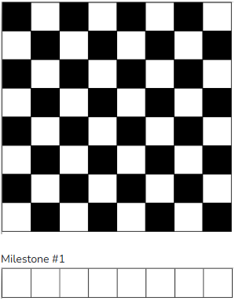
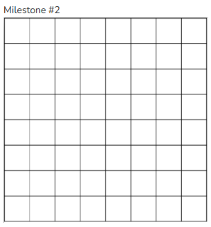

## Chessboard




### Milestone #3
For the last milestone, it is helpful to notice that if you add the row and the column number together, you get a number. If that number is even, you should color the square black.

*Note: If you're using a screen reader, it may be helpful to decrease the size of the chess board for easier debugging.*

### Given Code
```python
"""
This is a worked example. This code is starter code; you should edit and run it to 
solve the problem. You can click the blue show solution button on the left to see 
the answer if you get too stuck or want to check your work!

Note: The starter code for this example is the solution.
"""

from graphics import Canvas
import random

CANVAS_WIDTH = 400
CANVAS_HEIGHT = CANVAS_WIDTH
N_ROWS = 8
N_COLS = N_ROWS
SIZE = CANVAS_WIDTH / N_ROWS

def main():
    canvas = Canvas(CANVAS_WIDTH, CANVAS_HEIGHT)
    
    # For each row and column, draw a square
    for r in range(N_ROWS):
        for c in range(N_COLS):
            draw_square(canvas, r, c)
            
def draw_square(canvas, r, c):
    """
    Draws a square at row r, column c. Also prints out the row and column.
    """
    
    print(r, c)
    
    color = get_color(r, c)  # Get the square's color based on the row and column
    x = c * SIZE  # Calculate left_x
    y = r * SIZE  # Calculate top_y
    end_x = x + SIZE  # Calculate right_x
    end_y = y + SIZE  # Calculate bottom_y
    
    canvas.create_rectangle(x, y, end_x, end_y, color, 'black')  # Draw the rectangle
            
        
def get_color(r, c):
    """
    Get's the color of the checkerboard square at row r column c.
    """
    
    if is_even(r + c):
        return "green"
    else:
        return "beige"
        
def is_even(value):
    """
    Returns whether or not a number is even.
    """
    
    return value % 2 == 0


# There is no need to edit code beyond this point

if __name__ == '__main__':
    main()
```

