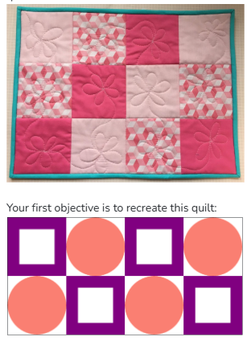
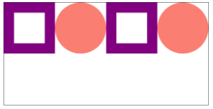

## Assignment - Quilt
A quilt, as you may know, is a blanket often composed of repeating "patches". Here is a quilt in the real world:



Each patch has height and width of 100 pixels, given by the constant PATCH_SIZE. There are two different patch patterns that repeat in different locations.

In this assignment each patch will be defined by a function. For example consider the draw_square_patch function which is already implemented for you in the starter code:

```python
def draw_square_patch(canvas, start_x, start_y):
    # draws a purple frame at (start_x, start_y)
    ...
```

draw_square_patch is passed three parameters, 
1. canvas: the canvas upon which we are drawing
2. start_x: the left side of the patch is start_x pixels from the left side of the canvas
3. start_y: the top of the patch is start_y pixels from the top of the canvas

This function can be reused as many times as you like. For example main calls it with different values for start_x and start_y. Different style patches, like the circle patch will have their own functions, but will take in the same three parameters.

The starter code has two places marked TODO. Fill them in to solve the task. You will need to define the circle patch function and make all the necessary function calls in order to draw the second row.

```python
# TODO: your code here
```

## Milestone 1: Circle Patch
The draw_circle_patch function has not been implemented. Your first task is to complete the code in the body of draw_circle_patch. You should simply draw a circle that fills the patch at the provided location. You can make the circle any color you like, the one in this demonstration is 'salmon'. Once you have implemented this function, your quilt should look like this:



## Milestone 2: Second Row
The main function currently creates four patches. Your next job is to add four more lines to main so that it draws the second row. Note that the start_y values should all be PATCH_SIZE because the second row is PATCH_SIZE pixels from the top of the canvas.

## Milestone 3: Collaborate
When you are done, push the "Check Correct" button. Then, you can optionally participate in making a big and wonderful Code in Place quilt. Create the most interesting patch you can think of and share the function definition on the forum. Find patches you love and incorporate them into your quilt. 

https://codeinplace.stanford.edu/cip3/forum?post=51332f4a-84a3-4cc5-8d58-5c240dc48a06 

To keep everything standard, each patch function should all take the same three parameters (canvas, start_x, start_y). All patches should be designed and should all be 100 pixels wide by 100 pixels high.

## Given Code
```python
from graphics import Canvas

# each patch is a square with this width and height:
PATCH_SIZE = 100
CANVAS_WIDTH = PATCH_SIZE * 4
CANVAS_HEIGHT = PATCH_SIZE * 2

def main():
    canvas = Canvas(CANVAS_WIDTH, CANVAS_HEIGHT)
    # draw the first row of patches
    draw_square_patch(canvas, 0, 0)
    draw_circle_patch(canvas, PATCH_SIZE, 0)
    draw_square_patch(canvas, PATCH_SIZE*2, 0)
    draw_circle_patch(canvas, PATCH_SIZE*3, 0)
    # TODO: your code here
    
def draw_circle_patch(canvas, start_x, start_y):
    # TODO: your code here
    pass

def draw_square_patch(canvas, start_x, start_y):
    # draws a purple frame at (start_x, start_y)
    end_x = start_x + PATCH_SIZE
    end_y = start_y + PATCH_SIZE
    inset = 20
    # first draw a purple square over the entire patch
    canvas.create_rectangle(start_x, start_y, end_x, end_y, 'purple')
    # then draw a smaller white square on top
    canvas.create_rectangle(start_x+inset, start_y+inset, 
        end_x-inset, end_y-inset, 'white')
    
if __name__ == '__main__':
    main()
```

## Answer
```python
from graphics import Canvas

# each patch is a square with this width and height:
PATCH_SIZE = 100
CANVAS_WIDTH = PATCH_SIZE * 4
CANVAS_HEIGHT = PATCH_SIZE * 2

def main():
    canvas = Canvas(CANVAS_WIDTH, CANVAS_HEIGHT)
    # draw the first row of patches
    draw_square_patch(canvas, 0, 0)
    draw_circle_patch(canvas, PATCH_SIZE, 0)
    draw_square_patch(canvas, PATCH_SIZE*2, 0)
    draw_circle_patch(canvas, PATCH_SIZE*3, 0)

    # Second row of patches
    draw_circle_patch(canvas, 0, PATCH_SIZE)
    draw_square_patch(canvas, PATCH_SIZE, PATCH_SIZE)
    draw_circle_patch(canvas, PATCH_SIZE*2, PATCH_SIZE)
    draw_square_patch(canvas, PATCH_SIZE*3, PATCH_SIZE)

def draw_circle_patch(canvas, start_x, start_y):
    # Draw a salmon-colored circle that fills the patch
    end_x = start_x + PATCH_SIZE
    end_y = start_y + PATCH_SIZE
    canvas.create_oval(start_x, start_y, end_x, end_y, 'salmon')

def draw_square_patch(canvas, start_x, start_y):
    # draws a purple frame at (start_x, start_y)
    end_x = start_x + PATCH_SIZE
    end_y = start_y + PATCH_SIZE
    inset = 20
    # first draw a purple square over the entire patch
    canvas.create_rectangle(start_x, start_y, end_x, end_y, 'purple')
    # then draw a smaller white square on top
    canvas.create_rectangle(start_x+inset, start_y+inset, 
        end_x-inset, end_y-inset, 'white')

if __name__ == '__main__':
    main()
```

