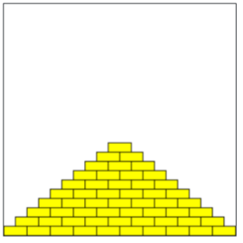

## Assignment - Pyramid
Write a program that draws a pyramid consisting of bricks arranged in horizontal rows, so that the number of bricks in each row decreases by one as you move up the pyramid. A sample run is shown below.



The pyramid should be **centered** at the bottom of the drawing canvas and should use constants for the following values:

* **BRICK_WIDTH** The width of each brick (30 pixels) 
* **BRICK_HEIGHT** The height of each brick (12 pixels) 
* **BRICKS_IN_BASE** The number of bricks in the base (14)

*Note: If you're using a screen reader, you may want to start with a smaller pyramid (smaller **BRICKS_IN_BASE**) for easier debugging.*

You should write your program so that, if the constant values were different, the pyramid drawn would reflect the values in those constants (i.e., brick sizes or the number of bricks in the base could be different).

The bricks can be any color you like. Here is an example of drawing a single yellow brick in the top left corner of the canvas:

```python
canvas.create_rectangle(
    0, 0, 
    BRICK_WIDTH, BRICK_HEIGHT, 
    "yellow", "black"
)
```

## Given Code
```python
from graphics import Canvas
import random

CANVAS_WIDTH = 600      # Width of drawing canvas in pixels
CANVAS_HEIGHT = 300     # Height of drawing canvas in pixels

BRICK_WIDTH	= 30        # The width of each brick in pixels
BRICK_HEIGHT = 12       # The height of each brick in pixels
BRICKS_IN_BASE = 14     # The number of bricks in the base

def main():
    canvas = Canvas(CANVAS_WIDTH, CANVAS_HEIGHT)
    # TODO, your code here
    

if __name__ == '__main__':
    main()
```

## Answer
```python
from graphics import Canvas

CANVAS_WIDTH = 600      # Width of drawing canvas in pixels
CANVAS_HEIGHT = 300     # Height of drawing canvas in pixels

BRICK_WIDTH	= 30        # The width of each brick in pixels
BRICK_HEIGHT = 12       # The height of each brick in pixels
BRICKS_IN_BASE = 14     # The number of bricks in the base

def main():
    canvas = Canvas(CANVAS_WIDTH, CANVAS_HEIGHT)

    # Loop through each row of the pyramid
    for row in range(BRICKS_IN_BASE):
        bricks_in_row = BRICKS_IN_BASE - row
        # Compute horizontal start so the row is centered
        row_width = bricks_in_row * BRICK_WIDTH
        start_x = (CANVAS_WIDTH - row_width) / 2
        # Compute vertical position
        y = CANVAS_HEIGHT - BRICK_HEIGHT * (row + 1)

        # Draw all bricks in the current row
        for brick in range(bricks_in_row):
            x1 = start_x + brick * BRICK_WIDTH
            y1 = y
            x2 = x1 + BRICK_WIDTH
            y2 = y1 + BRICK_HEIGHT
            canvas.create_rectangle(x1, y1, x2, y2, "yellow", "black")

if __name__ == '__main__':
    main()
```