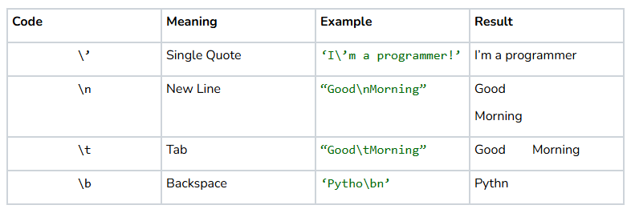

# Print

## Quest
Get ready... because you are about to experience a rite of passage for all new programmers: writing your first `Hello World` program! To do this, we will learn about the `print` function, the first of many new tools. Let’s see how it works!

## Printing to the Console
The `print` function simply writes text to the console. When reading a `print statement`, the computer takes whatever you put between the parentheses of the function, such as a word, number, or sentence, and displays it directly in the console. We will use this function often in our programs whenever we want the computer to communicate something to the user. Below is our Hello World program, which prints `"Hello, world!"` when executed. Run the program to see `print` in action!

```python
def main():
    print("Hello, world!")

if __name__ == '__main__':
    main()
```
=> Run >_ Show


## Basics of Function Anatomy
As we mentioned before, it is what's inside the parentheses in a print statement that tells the computer what to print. Many times, a function will need a bit of extra information before it can do its job. `print`, for example, doesn’t know what you want it to write unless you tell it! The text you give `print` is called an argument, and we put the `arguments` of a function inside those parentheses at the end. In the code below, functions like `main()` don’t have any arguments. They can do their job without any extra info from the programmer, so we just leave the parentheses empty.

## Printing on a new line
After printing something to the console, Python moves down to the next line so that any additional text is separated from what you just printed. We see this come up when using multiple `print` statements in the same sentence:

```python
def main():
    print("hello, world!")
    print("hello, trees!")
    print("hello, animals!")

if __name__ == '__main__':
    main()
```
=> Run >_ Show

## What can you print? 
`print` works for many different types of text, including words, numbers, and symbols. If you want to print a number, just put the number in as an argument. If you want to put a word or a sentence, you need to surround it with quotation marks to tell the computer that it is looking at written words instead of Python code. `print` doesn’t write out the quotation marks, but you have to include them so that Python understands what you mean.

```python
def main():
    # Output: 2
    print(2)

    # Output: 3.14
    print(3.14)
	
    # Output: Hello
    print("Hello")

    # Output: Python is cool!
    print("Python is cool!")

    # Output: I luv 2 code!
    print("I luv 2 code!")

    # Notice that even though 2 is a number, it still 
    # goes inside the quotation marks! print understands numbers
    # AND sentences that contain numbers


if __name__ == '__main__':
    main()
```
=> Run >_ Show

## "" vs ''
In other programming languages, there is a difference between single and double quotation marks. However, in Python, they are mostly equivalent. You can enclose words and sentences with either single or double quotes, but *not both!* 🛑

```python
def main():
    print("Hello, world!") # Perfect
    print('Hello, world!') # Yep!
    print("Hello, world!') # Very Bad!!!


if __name__ == '__main__':
    main()
```
=> Run >_ Show


We can be strategic about which set of quotes we want to use. 

If your text contains single quotes, you should use double quotes:
```python
 print("no, you didn't")   
```
**Output: no, you didn't**


If your text contains double quotes, you should use single quotes:
```python
 print('"Good morning!" said the cat')
```
**Output: "Good morning!" said the cat**

## Advanced (Optional) Reading
There is a third type of quotation mark, and you’ve already seen it before! Remember block comments? Well, more generally, a block comment is just a sentence or paragraph that fits on multiple lines. We use triple quotation marks for these multi-line paragraphs, and we could tell the computer to print one out:

```python
def main():
    """
    You probably won't need to use triple quotation marks
    very often, but it is an extra tool you have available
    to you if you need it. 

    Now, we're going to print this
    whole paragraph to the console!
    """
    print("""
    You probably won't need to use triple quotation marks
    very often, but it is an extra tool you have available
    to you if you need it. 

    Now, we're going to print this
    whole paragraph to the console!
    """)

if __name__ == '__main__':
    main()
```
=> Run >_ Show


## Separating Multiple Arguments
`print` can take in more than one value and print all of them together on a single line. We separate each value with a comma, and Python handles all the spacing for us. Multiple values do not have to be of the same type, and you can mix and match however you like:

```python
def main():
    # Output: My name is Kylen!
    print("My name is", "Kylen!")

    # Output: "My name is Claire and I have 15 friends."
    print("My name is", "Claire", "and I have", 15, "friends.")


if __name__ == '__main__':
    main()
```
=> Run >_ Show

## Escape Characters
When you press the return key to move to a new line, do you know how your computer keeps track of where the new line should begin? `Escape characters` are special symbols you can add between your quotation marks to stylize the text in various ways. Each escape character starts with a backward slash \ followed by a special code. There are several escape characters you can use, but below are the most common ones:

