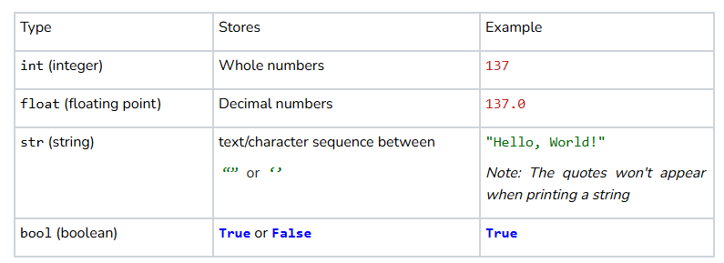
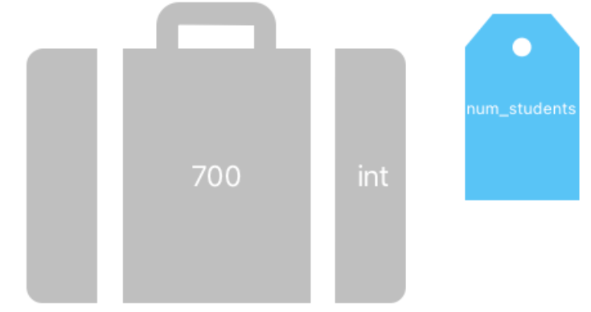

# Variables
## Quest
Writing instructions like print statements is a big first step in programming knowledge. You are well on your way to writing your very own Python programs! In addition to telling a computer what to do, we can also ask a computer to store information for us. After all, we humans can only remember so much at once, and it’s incredibly useful to let our computers handle all that memorization.

## Variables
What are some examples of information we might want to keep track of? 
* A person’s name?
* How old is my friend?
* How many apples are left in my apple tree?
* Do I own a hat?
* What is the third letter of the English alphabet?

As you can see, there are many different types of information you might want to store. Sometimes you are keeping track of a word, sometimes a number, or sometimes just a simple “Yes” or “No” like with “Do I own a hat?” As you might have guessed, your computer can store this information, too.

When you want your computer to keep track of some data, you’ll need to create a `variable`. Variables are made up of three things:

1. The `value` of your variable is the thing you want your computer to remember. A value could be something like a number or a word.
2. The `name` of the variable is like a label. It helps you keep track of what the value represents and typically describes the information stored in the variable.
3. The `type` of a variable is what sort of data we are trying to store. Maybe we want to store someone’s age, which is a number. What about their name, a word? Depending on what sort of information the computer is keeping track of, it will use a variable of a specific type.

## Assigning a Variable
So, how do we make one of these handy variables? We use something called the `assignment operator`! It’s just the equals sign '='. However, it is important to remember when programming in Python that the equals sign *does not mean equals!*

Take this line of code, for example:

```python
age = 22
```

We aren’t just equating the word age with the number 22. Instead, we are telling the computer to assign the integer 22 to the variable called age.

The template for creating a new variable is as follows:
```python
name = value
```
where *name* is the name of your variable and *value* is the data you want to be stored.

## Memory Addresses


Your computer has tons of these things called **memory addresses**. You can think of them as little suitcases where you can store a piece of data. When we make a new variable, the computer finds an empty memory address and stores the value you give it inside that little suitcase.  


To keep track of where it puts your value, the computer assigns the location of that memory address to the name you chose for your variable. Think of this as a sort of luggage tag. Now, if you ever need to get that value back, you just use the name `age`, and the computer knows you mean, “I want the value assigned to the name `age`.” The computer will then give you access to whatever is inside of the suitcase. 

Here’s how not to create a variable 🛑

```python
def main():
    # Example 1
    22 = age
 
    # Not quite! When assigning to a variable, always put the name on the left 
    # side and the value on the right

    # Example 2
    age

    # This is how you access the value of age. Unless 'age' is already a 
    # variable, this won't make sense to your computer.

if __name__ == '__main__':
    main()
```
=> Run >_Show

Let’s check out a program that uses one of these handy new variables:

```python
def main():
    message = "Good Morning!"
    message = "Good Night!"
    print(message)

if __name__ == '__main__':
    main()
```
=> Run >_Show

Can you guess just by reading this code what the program will print out? Let’s jump right in and see what’s going on.

```python
message = "Good Morning"
```

On this first line here, we are creating a new variable called `message` and giving it a value of the string `"Good Morning"`. We know we are creating a new variable because the name `message` hasn’t been used yet. `"Good Morning"` is an example of a **string**, one of those variable types we were talking about. We use strings to store symbols like A, a, 0, 1, $, #, and many others. We'll show you some other data types in a moment.

```python
message = "Good Night!"
```

On the next line, we see message again, but we’re not actually assigning a new variable this time around. Once a variable is made with a certain name, using that name again now refers back to the variable you already created. This line assigns a new string, `"Good Night!"` to the name `message`. This overwrites the value of message, and we lose `"Good Morning!"` forever!

```python
print(message)
```

This third line is a print statement. Here, message is just hanging out by itself, and we aren't assigning it a new value. Instead, we want to know which value is stored in that variable right now! When you write the name of a variable as a standalone word in your code, what you’re saying is, “Hey, computer, when you see this name, go get the current value of that variable and switch it with the variable’s name here.”

So, if we were to run this program, here's what would happen:
1. We create a new variable `message` and assign it the value `"Good Morning!"`
2. We assign `message` a new value `"Good Night!"`
3. We replace the word `message` in the print statement with its current value, `"Good Night!"`
4. We run the instruction `print("Good Night!")`, which prints the string `"Good Night!"` to the console.

## Using a Variable
As another example of accessing the value of a variable, your friend, Evan, wants you to keep track of how many pets he owns. He tells you that he has 4 pets, so you add the following line to your program:

```python
num_evans_pets = 4
```

Now, if you ever need to reference how many pets Evan has, you can just use the name `num_evans_pets`. What if your other friend, Anna, tells you she has just as many pets as Evan? Instead of asking Evan how many pets he has and storing that number for Anna, you can just reference the variable that stores how many pets Evan has:

```python
num_evans_pets = 4
num_annas_pets = num_evans_pets	 # num_annas_pets now equals 4
```

## Every Variable Has A Type
As we mentioned before, a variable has a **type**. Computers store words and sentences differently than they store numbers. We call these different types **primitives**. The most common primitive types are shown below: 



One thing to note about Python is that the type of a variable is not set in stone. You can assign a value of a different type to change the type of the variable: 

```python
def main():
    x = "hi"    # x is a string
    x = 7       # x is now an integer
    print(x)

if __name__ == '__main__':
    main()
```
=> Run >_Show

Even as you change variables, python keeps track of what types your variables are:
```python
num_students = 700
```



Example: Python knows that `num_students` is an int value.\
If `num_students` were to be reassigned to be a `string`, Python would update its type as well. 

## Swapping Two Variables
In coding, you often find that you have two variables, and you want to swap their values. On your first try, it might seem simple to just do something like this: 

```python
a = "Chris Piech"
b = "Mehran Sahami"

a = b    # a now points to "Mehran Sahami"
b = a    # b still points to "Mehran Sahami"
```

This is wrong!  The code `a = b` puts the `a` luggage tag on the `“Mehran Sahami”` luggage. At this point, there is no luggage tag on the `“Chris Piech”` luggage, so the luggage is lost. Both variables a and b are on the `“Mehran Sahami”` luggage, and we have an unsuccessful swap.

To fix this issue, we use a **temporary variable.**

```python
a = "Chris Piech"
b = "Mehran Sahami"

temp = a    # temp points to "Chris Piech"
a = b       # a now points to "Mehran Sahami"
b = temp    # b now points to "Chris Piech". We swapped!
```
The `temp` variable stores `“Chris Piech”` so that it is not lost when we reassign a. We have a successful swap!

## Printing Variables
Sometimes, to debug our code, we will print out the value of a variable. 
```python
def main():
    name = "Halie"
	
    # Output: "Halie"
    print(name)


if __name__ == "__main__":
    main()
```
=> Run >_Show

See how, although the word `name` is inside the print statement, the console actually prints the value of the variable called `name`, which is `“Halie”`

Forgetting to put quotation marks around your string literals is **a very common bug** ⚠️. If you forget your quotes, Python will think you are referring to a variable:

```python
def main():
   age = 7

   # Output: "age"
   print("age")

   # Output: 7
   print(age)


if __name__ == "__main__":
	main()
```
=> Run >_Show

Notice how `"age"` with quotation marks prints the string `“age”` but the `age` without quotes prints `7`.


