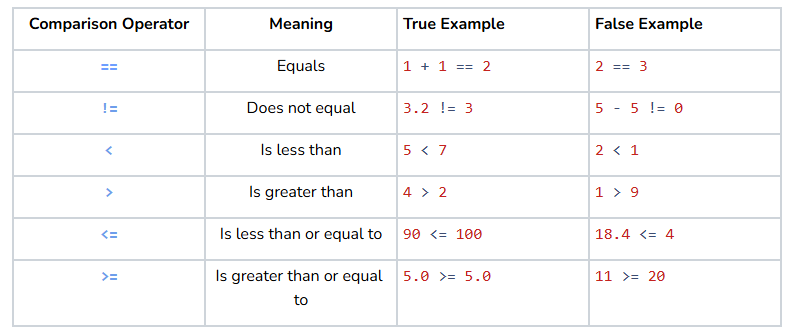
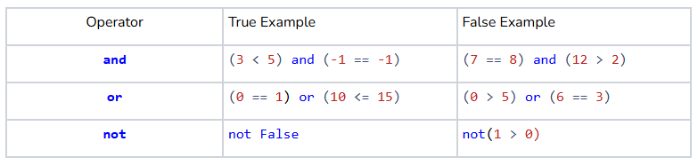

# Conditionals
## Quest
True or false, is coding the coolest thing ever? We sure think so, but technically you could’ve said false. We use the **boolean** **variables** `True` and `False` to store the answers to *Yes* or *No* questions. Am I a student, yes or no? Is my refrigerator on, or is it off? In this section, we will learn how to ask some of these True or False questions in Python. We will look at some of the fundamental questions you can ask about data and how we can build upon these questions to make powerful programs.

## Comparison Operations
Which is heavier, a kilo of rocks or a kilo of feathers? Actually, it’s a trick question because both weigh exactly one kilogram! The idea of comparing two things is something that will come up a ton when programming. Luckily for us, Python has just what we need to get the job done! Each comparison operator takes two values and reasons something about their relationship. The result of the operation is a boolean value indicating whether the condition of that particular operation was met. Here are the comparison operators and an example of when each would return `True` and `False`:



## Logical Operations
Sometimes, one comparison operation isn’t enough. Say, for example, you are writing a program for an online bakery. The bakery limits each customer to a dozen cookies, and they want you to make sure nobody orders more cookies than what is left in stock. Each time a person places an order, you now have two things to check:

1. Did they order a dozen cookies or less?
2. Do we have enough cookies in stock to fill this order?

We could ask these questions one at a time, but wouldn’t it be handy if there was a way to check if both were `True` at the same time? Spoiler alert... you totally can, through the magic of **logical operations**. Just like comparison operations, these logical operations will also return a boolean value. The difference is that comparison operations take in variables, while logical operations take in other boolean values. Here are the three main logical operators you will use in your programs:



The `and` operator checks if two statements are both `True`, while the `or` operator checks if one **or both** are `True`. It is important to realize that this is an *inclusive* or, meaning all we care about is that *at least one* of the two is `True`. The `not` operator is interesting. It returns `True` if the following statement is `False`. 

You might look at `not(2==3)` and think, “Wait a minute, couldn’t you just say *2 != 3.”* Both would do the exact same thing. The `not` operator might seem redundant in the context of comparison operations, but it will become much more useful in the next section about expressions.

## Logical Expressions
A **logical expression** is one or more boolean values connected with logical operations. These boolean values could come from anywhere: a comparison operation, a logical operation, a boolean function, a boolean variable, or even a literal boolean value `True` or `False`. Just like before, the entire logical expression will evaluate `True` or `False`, so we can use it as a conditional just like we would any other boolean:

```python
def main():
    name = "Michael"
    age = 21
    born_in_december = True
    lucky_number = 6

    if name != "Mirelys":
        print("Hi, I don't think we've met before!")
    if age == 21 or not(born_in_december):
        print("Do you remember...")
    if lucky_number > 5 and name == "Michael" and not(age == 30) and born_in_december:
        print("Hey! I've been looking all over for you!")

if __name__ == '__main__':
    main()
```
=> Run >_Show

All three of these expressions are true. Can you see why?

## Precedence

In Python’s logical order of operations, comparison operations are evaluated before logical operations. An operator has greater **precedence** if Python evaluates it before another. If two operations have the same precedence, then Python evaluates whichever comes first in the expression. Even though the third logical expression above contained many comparisons and logical operators, Python just reads them left to right and had no trouble understanding what we meant. However, once you start mixing and matching `and`, `or`, and `not` together, things can get messy fast. Consider the following logical expression:

```python
a or not(b and c) and d or e and f or not(g)
```

*This is a nightmare!!!* Python will have no trouble understanding this because of its order of operations, but writing expressions in this way is destined to lead to mistakes. If you’re not careful, an expression like this could end up meaning something very different than what you intended. However, check out Python’s order of operations so far...


No matter what, parentheses always go first! We can use this to our advantage. By grouping related operations with parentheses, we can make our logical expressions much more readable to understand what we are coding and to avoid sneaky bugs:

```python
# Before
a or not(b and c) and d or e and f or not(g)

# After
(a or not(b and c)) and (d or e) and (f or not(g))
```
Not only do the parentheses make this expression easier to read, but where we put them affects what the expression means logically. Rather than going back and adding parentheses after you write your expression, it’s a good habit to use them from the start. This will also just make writing expressions a lot easier.

If you’re up for a fun challenge, which of the following expressions do you think will evaluate to `True`? Don't run the code until you have your answer!

```python
def main():
   a = True
   b = False
   c = False
   d = True

   # Option 1
   if (a and not(b)) and (b or (d and a)):
	   print("Option 1 is True!")
	
   # Option 2
   if a and (b or (d and not(not(c) or (a and d and c)))):
	   print("Option 2 is True!")
	
   # Option 3
   if (a and not(b) and not(c) and d and (a and d) and not(b or c)) and not(d and (a or (b and c)) and c):
      print("Option 3 is True!")


if __name__ == "__main__":
	main()
```
=> Run >_Show

