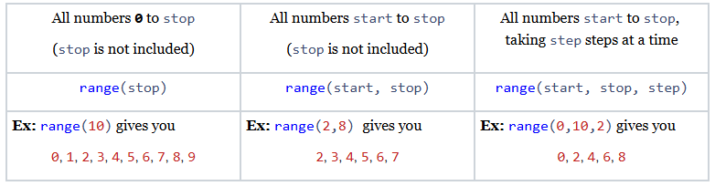

# Loops
## Quest
Try counting to ten in your head. Pretty easy, right? You likely had no trouble reciting those ten words "One, Two, Three..." from memory. Now, what if you had to teach somebody to count? First, you say "One," then you say "Two," then you say "Three" all the way until you say "Ten," and then you stop. It turns out that if we want our computer to count for us, we will have to teach it how using a **loop!**

## Repeat Repeat Repeat!
You might want to ask your computer to do the same thing multiple times. A game designer might tell the computer to restart a video game after the player loses. A website might ask a user for their password a second time if the user enters the wrong password. In cases like these, the computer is going to repeat some instructions more than once, and it would be rather redundant to copy the same code over and over and over and over and over again! So we use **loops**, or instructions that tell the computer to repeat a block of code multiple times.

## For vs While Loops
A **for-loop** repeats a block of code a fixed number of times, incrementing a counter at each repetition. A **while-loop** repeats a block code an indefinite amount of times until some condition is no longer met. The rule of thumb for choosing which loop to use is as follows:
* *If you know exactly how many times your loop will run, use a **for-loop**.*
* *If you don’t know how many times your loop will run, use a **while-loop**.*

## For Loops 
A for-loop has three parts:
1. **Loop Variable** - the variable that changes after each iteration of the loop
2. **Range** - Which values the loop variable takes on in each iteration
3. **Code Body** - the block of code that gets repeated at each iteration

The most basic for-loop is one that loops for all values from 0 to some number. This is how we get our computer to count to a certain number. We use the `range` function to specify which number that is:

```python
def main():
   for i in range(5):
        print("I can count to " + str(i + 1)) 

if __name__ == "__main__":
	main()
```
=> Run >_Show

## range()
Most of the time, you’ll just use the `range` function to set the number of times you want your code to loop. `range` is more powerful than this, though. What `range` does is present the for-loop with all the values that i should take on, and the for-loop just repeats once for each of those values. When we say 

```python
for i in range(some number):
```
we really mean “repeat the following code one time for each value from `0` to *some number”*.

Your code might need to be more specific than this. Maybe you want to start somewhere besides `0`, and instead only loop over all values from `5` to `10`. Maybe you only want to loop over even numbers in a range. `range()` can do all of these things!

Here is a brief guide for using the `range` function in various ways:



## While Loops
while-loops are *much simpler* than for-loops! They just run until some condition returns false:

```python
def main():
	print("Pop Quiz! How many continents are there on Earth?")
	answer = int(input())
	while(answer != 7):
		print("Not quite, guess again!")
		answer = int(input())
	print("That's right! There are seven continents on Earth!")

if __name__ == '__main__':
    main()
```
=> Run >_Show

In the above program, the while-loop checks each time it repeats whether the user has inputted the correct answer. If the current answer is not `7`, the expression  `answer != 7` evaluates to `True`, and the loop repeats once more. Eventually, if the user answers `7`, `answer != 7` evaluates to `False`, and the loop ends.

How many times do we need to repeat before the user gets the question right? We don’t actually know! They could get it on their first try, or they could never get it right. while-loops are perfect for this sort of situation. With a for-loop, we would have to set some maximum number of attempts before the loop forcibly ended, whereas a while-loop can go on indefinitely until the user gets the right answer.

## Infinite Loops
It is important that we don’t *actually* write code that will never stop. An **infinite loop** is when your code gets stuck in an endless cycle of repeating code and never finishes. It’s pretty hard to get a Python for-loop stuck in an infinite loop, but we need to be especially careful with while-loops. Let’s look at a couple of examples of code that will run forever:

```python
# The key to thwarting an infinite loop is to look for conditions that will never be False 

# The boolean value True will never be False
while True:
    print("I am always True")

# i keeps decreasing and will always be less than 1
i = 0
while i < 1:
    i = i - 1

# Since two boolean values are always either equal or not equal this 
# condition will never be false
a = True
b = False
while (a == b) or (a != b):
    print("Can't make up your mind?")
```