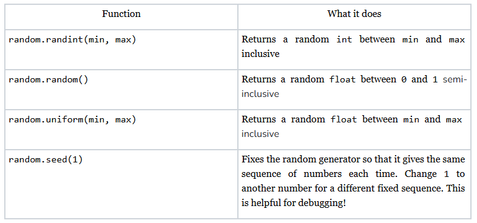

# Random
## Quest
Have you ever played a board game with dice? What about a game with a shuffled deck of cards? Both types of games include some degree of randomness. The order of the cards or the number that you get when you roll the dice is entirely random. So how do we get randomness in code? It turns out that Python has a library, or a pre-made collection of code, for getting random numbers. 

To get access to the `random` library, we simply use the import keyword: 

```python
import random
```

By the end of this section, you should be able to generate both random ints and floats of varying ranges by using the `random` library’s most basic functions. 

## Useful Functions
Here are a few of the most useful functions in the `random` library for this class: 



## random.randint
If you are building a game, and you decide that you want to build in a roll dice function. Using the `randint` function, you might do something like this: 

```python
import random

def main():
    # generate a random number between min 1 and max 6
    dice_roll = random.randint(1, 6)
    print('dice value:', dice_roll)

if __name__ == "__main__":
    main()
```
=> Run >_Show

If you run the above program a bunch of times, you won't always get the same result.\
Another thing to note is that both `1` and `6` are possible outputs of `randint` because the function is **inclusive**. 

## random.random
The `random.random` function gives back a float between `0.0` and `1.0` (values can include `0.0` but not `1.0` which is called **semi-inclusive**). This can be useful when we want to get random numbers that have decimal values.

Let's say the board has squares and each square has the possibility of being a bomb square. If players land on a bomb square, they have to go back to the start. To determine whether a square is a bomb or not, we can assign it a random probability. 

You do not need to understand probability for this class. Without going into too much detail, a probability is a value between `0` and `1` that describes the likelihood of something happening. In this case, the likelihood of being a bomb square. 

If the square’s probability is larger than a certain value (we’ll call this the threshold) then we will determine it is a bomb. 

```python
import random

# generate random probability between 0 and 1 (including 0)
def main():
   threshold = 0.80

   # get the probability
   probability = random.random()

   # determine if the square is a bomb
   is_bomb_square = probability > threshold

   print(probability)
   print(is_bomb_square)


if __name__ == "__main__":
   main()
```
=> Run >_Show

Once again, run this multiple times to see the different results. 

## random.uniform
So our game has dice. It has a game board. What about the avatars? Let’s say that we want each player to have a unique avatar for playing this online board game. We want each avatar to be unique so that players have lots of options to choose from. To create some variety in the avatars, the first thing that we want to do is give each avatar a random height. 

Our avatars aren’t human, so their heights can range anywhere from `1.0` to `3.0` meters (3 feet 3 inches to 9 feet 10 inches for our American programmers). 

This means that we want float values, so we can’t use `randint`, but we also want our values to be bigger than 1, so we can’t use `random.random`. To get our random heights, we will have to use `random.uniform`.

The numbers that are generated from `random.uniform` go out many many decimal places, but we only want to use go out to 3. We can use Python’s built-in round function to round it to 3 decimal places. The round function takes in the number to round and the number of decimal places to round it to.

```python
import random

def main():
   # generate random height between 1.0 and 3.0 (inclusive)
   height_in_meters = random.uniform(1.0, 3.0)
   height_in_meters = round(height_in_meters, 3)
   print("height: " + str(height_in_meters) + "m")

if __name__ == "__main__":
   main()
```
=> Run >_Show

Run this multiple times to see the different results. 

One thing to note: like `random.randint`, `random.uniform` is **inclusive** which means that the values it outputs can include min and max. 

## random.seed
To make random numbers, Python’s random library uses a **random number generator**. You don’t need to understand how this generator works, but one thing that is useful to know is that it can be fixed.

```python
import random

def main():
   random.seed(1)
   print(random.randint(0, 100))

   random.seed(1)
   print(random.randint(0, 100))

   random.seed(0) # different seed gives different number
   print(random.randint(0, 100))


if __name__ == "__main__":
   main()
```
=> Run >_Show

As you can see if you run the above code, `random.randint` gave the same number twice. Using the seed method ensures that the generator will give the same sequence of numbers every time, but only for the same seed. It is also important to note that you have to say `random.seed()` every time you want the sequence to be the same. 

It might seem counterintuitive to have a function that makes random number generation less random, but this becomes useful when we are trying to debug a program involving random numbers. 


