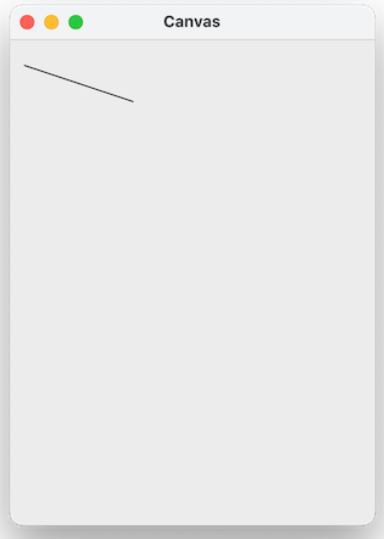

# Basic Shapes
## Introduction to Graphics

## Quest
All the apps on your computer, everything from the calculator to the file explorer to the very browser you might be reading this in right now, are all programs that use graphics to make interactive, visual programs. 


## Text vs Graphics
Up until now, the programs you have been writing are called **text-based programs** because the user interacts with them using the text displayed in the console. 

Programs that use visual features like images, colors, or buttons are **graphical programs**. When you set out to write programs of your own, you can ask yourself what kind of program you want to write. Some programs are better left as text-based programs, while others would benefit from a graphical component. Maybe times you get to choose, as you could use either text, graphics, or a combination of both to get the result you want.


## Python Graphics
**One of the most common libraries to create graphics in Python is called Tk** (short for "tkinter"). Tk is a powerful graphics library that should be automatically installed for Windows and Mac along with Python when you install it. While Tk is great, some of the functions are hard to use. 

For this reason, we provide our own small graphics library that is built on top of Tk and makes it easier to use. It is not a replacement for Tk - it just added a few new functions to make certain things like drawing text easier. 

## Importing
To use our graphics library, you must first import it at the top of your program by adding this line of code to the top of your file: 

```python
from graphics import Canvas
```

## The Canvas
The drawing model for the graphics library is a `canvas` (much like a painting) where you are going to draw various shapes. 

The canvas is a grid of `pixels` that have x and y values. The coordinate (0,0) is in the upper left-hand corner of the canvas. The values of x increase as you move to the right. The values of y increase as you move down. In other words, you can think of the canvas as follows: 


When we want to draw shapes on a canvas, we call functions on that canvas that "create" the shape we want to draw. These shapes then appear on the canvas. We will generally provide the code that creates the canvas for you, so all you need to worry about is adding shapes to that canvas. 

For the remainder of this section, we will assume that a variable named `canvas` has already been created, and it represents the canvas that you'll be drawing on. Usually, this will be done with the following provided code: 

```python
# create a new canvas
canvas = Canvas(800, 200)
```

When we create the canvas, we specify its width and height. For example, the above code will create a canvas that's 800 pixels wide and 200 pixels tall


## Basic Shapes
Below is a brief exploration of some of the different shapes you can draw on a canvas and a few of the options you have for changing the style of those shapes. 

### *Creating Shapes:*
Each time you want to draw a new shape on the screen, you use one of the various functions provided by our graphics below. They all follow a general naming convention `canvas.create_<shape>` where `<shape>` is just the name of whichever shape that particular function draws.

These functions do two things. They each draw some shape on the screen, but then they also return an integer associated with the order in which the shape was added to the canvas. \
Drawing the first shape will return an ID of 1; drawing the second shape will return 2, and so on. \
Keeping track of these IDs is a smart move in case you want to refer to that shape later on in your code (perhaps to move or delete it). While technically, you don't have to store the shape's ID to draw a shape, it is generally good practice to store each shape you create as a variable like so:

```python
line = canvas.create_line(...) # some parameters go in here
```

### *Drawing Lines:*
To draw lines on the canvas, use `create_line` and specify the coordinates for the start and end points of the line and the line's color as a string. For example, the following command would draw a black line from location (10, 20) to (100, 50) on the canvas:

```python
canvas.create_line(10, 20, 100, 50, 'black')
```



By default, all lines are drawn in black if you omit the color parameter. 

### *Drawing Rectangles:*
To draw a rectangle on the canvas, use `create_rectangle` and specify the coordinates for the top left corner and bottom right corner of the rectangle, as well as a color as a string. For example, the following command would draw a yellow rectangle with the upper left-hand corner at (5, 50) and the lower right-hand corner at (100, 200) on the canvas:

```python
canvas.create_rectangle(5, 50, 100, 200, 'yellow')
```


By default, all rectangles are drawn in black if you omit the color parameter. 

### *Drawing Ovals:*
To draw an oval on the canvas, use `create_oval` and specify the coordinates for the top left corner and bottom right corner of the bounding box containing the oval you would like to draw. \
In other words, imagine that there is a rectangle around the oval you would like to draw (we call this a bounding box). The sides of the invisible rectangle will just touch the top, bottom, right, and left of the oval based on the coordinates you specify. You'll also specify a color as in the previous functions. 

For example, the following command would draw a red oval that fits within a bounding box with the upper left-hand corner at (5, 50) and lower right-hand corner at (100, 200) on the canvas: 
```python
canvas.create_oval(5, 50, 100, 200, 'red')
```


By default, all ovals are drawn in black if you omit the color parameter. 

To make clear the notion of a bounding box, we draw the same red oval and yellow rectangle from before, where both the oval and rectangle have the same coordinates. Notice how the rectangle is like a bounding box around the oval. 
```python
canvas.create_rectangle(5, 50, 100, 200, 'yellow')
canvas.create_oval(5, 50, 100, 200, 'red')
```


## Drawing Text

To draw text on the canvas, use create_text and specify an x and y coordinate, the text, and the following optional parameters:
* font
* font_size
* color
* anchor

The `anchor` is a string, one of "n", "ne", "e", "se", "s", "sw", "w", "nw", or "center", that describes what side of your text you want to position at the (x, y) you provide. `font` describes the style and size of the text, for example, 'Helvetica 32'. \
The `text` is the text string you want to appear on the screen. Here's a sample call of `create_text` with all of the necessary parameters (this is all one line, we've just split it to fit on the page):

```python
canvas.create_text(50, 50, font='Arial', font_size = 50, text='My first text!', color='blue')
```


### *Drawing Polygons:*
You can draw irregular shapes on the canvas using create_polygon! Every pair of arguments represents a point on this shape, and the format looks something like this:

```python
# You can add as many coordinate pairs as you like
canvas.create_polygon(x1, y1, x2, y2, x3, y3, ...)
```

As an example, let's try to draw a triangle! This program draws a triangle in the middle of the canvas according to some constants:

```python
from graphics import Canvas
    
CANVAS_WIDTH = 400
CANVAS_HEIGHT = 400
TRIANGLE_WIDTH = 100
TRIANGLE_HEIGHT = 100

def main():
    canvas = Canvas(CANVAS_WIDTH, CANVAS_HEIGHT)
    
    # Point 1: Bottom Left
    x1 = (CANVAS_WIDTH - TRIANGLE_WIDTH)/2
    y1 = (CANVAS_HEIGHT + TRIANGLE_HEIGHT)/2
    
    # Point 2: Bottom Right
    x2 = (CANVAS_WIDTH + TRIANGLE_WIDTH)/2
    y2 = (CANVAS_HEIGHT + TRIANGLE_HEIGHT)/2
    
    # Point 3: Middle
    x3 = CANVAS_WIDTH/2
    y3 = (CANVAS_HEIGHT - TRIANGLE_HEIGHT)/2
    
    canvas.create_polygon(x1, y1, x2, y2, x3, y3)

if __name__ == '__main__':
    main()
```
=> Run >_Show

As an extra challenge, try to figure out what each calculation is doing to center the triangle on the canvas!

### *Drawing Images:*
Have a neat image you want to share with Code in Place? First upload an image to your project (see the files tab in your IDE). Then you can add that image to the canvas!

```python
# Creates an image with the image's top left corner at (left_x, top_y)
image = canvas.create_image(
    left_x, 
    top_y, 
    filename  # Ex. "simba.png"
)

# Image with a specific size
image = canvas.create_image_with_size(
    left_x, 
    top_y, 
    width, 
    height, 
    filename
)
```

## Removing Objects From the Canvas
You can remove objects from the canvas using delete:

```python
rect = canvas.create_rectangle(100, 200, 300, 400, 'yellow')
...
canvas.delete(rect)
```

Note that deleting an object is `permanent` - if you want to temporarily make an object hidden, use set_hidden. You can pass in either `True` or `False` to set an object to be hidden or visible: 

```python
rect = canvas.create_rectangle(100, 200, 300, 400, 'yellow')
canvas.set_hidden(rect, True)  # no longer visible
...
canvas.set_hidden(rect, False) # visible again
```

## Object Ordering
\
Objects are drawn on the canvas in the order in which they are created by your code. So, if you draw a blue triangle after a green square, the blue triangle can potentially cover (occlude) part of the green square. This is sometimes referred to as the `z-order` of the objects.

As an example, below, we first draw a yellow rectangle, then draw a red oval (which partly overlaps the rectangle), and then some text (that is on top of both the rectangle and the oval).

```python
canvas.create_rectangle(10, 50, 200, 300, 'yellow')
canvas.create_oval(100, 100, 300, 350, 'red')
canvas.create_text(70, 170, anchor='sw', font='Arial 30', text='yay!')
```


## Changing Object Colors
Sometimes, we'll want to refer to an object after we've created it. \
Say, for example, we want to change an object's color. In that case, it's a good idea to store that object in a variable for us to use later. If the object is a rectangle, we might store it in a variable called rect and use the `set_color` function to change its color like this:

```python
rect = canvas.create_rectangle(0, 0, 50, 100, 'yellow')
...
canvas.set_color(rect, 'red')
```

We can also individually change the outline or fill of an object using the `set_color` and `set_outline_color` functions as follows:

```python
rect = canvas.create_rectangle(0, 0, 50, 100, 'yellow')
...
canvas.set_color(rect, 'red')
canvas.set_outline_color(rect, 'blue')
```

If you don't want to choose a color yourself, you can get a random one with `get_random_color` like:

```python
rect = canvas.create_rectangle(0, 0, 50, 100) # initially, the rectangle is black
random_color = canvas.get_random_color()
canvas.set_color(rect, random_color) # now it is filled with a random color
```

Here's a [list of all the colors](https://cs111.wellesley.edu/archive/cs111_fall14/public_html/labs/lab12/tkintercolor.html) you can use in Tk. 

## Getting Information About Objects

For all graphical objects, you can ask the canvas for information about them. For instance, you can get an object's dimensions via `get_object_width` and `get_object_height`: 

```python
rect = canvas.create_rectangle(0, 0, 50, 100, 'yellow')
print(canvas.get_object_width(rect))  # prints 50
print(canvas.get_object_height(rect)) # prints 100
```

You can also ask the canvas for information about an object's location. Specifically, you can get the left-most x coordinate of the object or the top-most y coordinate as follows:

```python
oval = canvas.create_oval(5, 10, 50, 100, 'red')
print(canvas.get_left_x(oval))  # prints 5
print(canvas.get_top_y(oval))   # prints 10
```

Note that for something like an oval, the dimensions, and left corner are from the bounding box that contains it.

## Moving Graphical Objects
You can change the location of an object using moveto. You specify new x and y coordinates, which will be the upper left corner of the bounding box for the object. Here's how we would move a rect to have an upper left corner at (25, 50): 

```python
rect = canvas.create_rectangle(100, 200, 300, 400, 'yellow')
canvas.moveto(rect, 25, 50)  # moves upper left to 25, 50
```

You can also change the location of an object by specifying how much you would like to move it by instead of specifying the new location. The move function lets you specify the change in x and the change in y for the object relative to its current location. For example, here's how we would move a rectangle 5 pixels to the right and 10 pixels down:

```python
rect = canvas.create_rectangle(100, 200, 300, 400, 'yellow')
canvas.move(rect, 5, 10)  # moves upper left to 105, 210
```