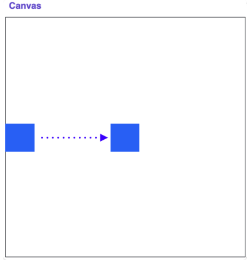
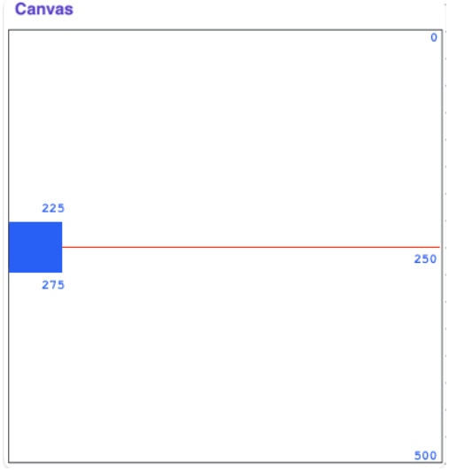
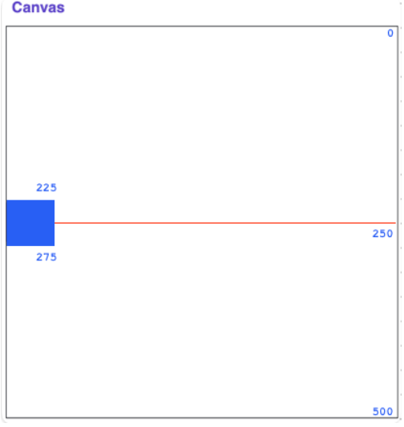
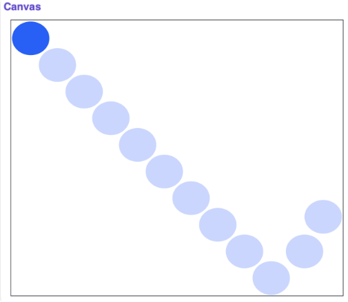
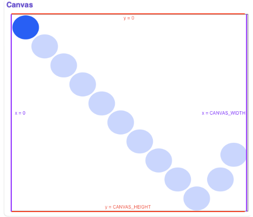

# Animation
## Quest
We know how to draw some basic shapes onto a canvas. But what if we wanted to make those shapes move? Animating shapes allows us to make cool and dynamic graphics like the ones you see in video games. Before we reach video-game-level animations, let's start with the basics. 

### GOAL 1: Make a square move to the center. 


From the last section, we know how to draw a rectangle onto the canvas: 

```python
from graphics import Canvas

SQUARE_SIZE = 50 
CANVAS_WIDTH = 500
CANVAS_HEIGHT = 500

def main():
    # makes a canvas
    canvas = Canvas(CANVAS_WIDTH, CANVAS_HEIGHT)
    
    # set y coordinates
    start_y = CANVAS_HEIGHT / 2 - SQUARE_SIZE / 2
    end_y = start_y + SQUARE_SIZE
    
    # draw the square
    canvas.create_rectangle(0, start_y, SQUARE_SIZE, end_y, 'blue')
    
if __name__ == "__main__":
    main()
```
=> Run >_Show 

Right now, this code draws a square that is centered on the left edge. Take a minute to understand the math behind `start_y` and `end_y`.
```python
start_y = CANVAS_HEIGHT / 2 - SQUARE_SIZE / 2
end_y = start_y + SQUARE_SIZE
``` 

If you look at the image above, you'll see that we want the image to start center of the canvas in the y direction and on the left edge. The line that represents the center of the canvas in the y direction is the line where `y = CANVAS_HEIGHT / 2`. 

---
For example, in our case, the line is where `y = 250`. 



As you can see, the red line which represents the middle of the canvas is halfway through the blue square. If we just set start_y to `CANVAS_HEIGHT / 2` then the red line would be at the top of the square. To center the square on the line, we have to subtract half the square's height (essentially "moving up" the square). 

`end_y` refers to the bottom right y coordinate. The difference between the top y coordinate and the bottom y coordinate is the height of the square, so to calculate `end_y`, we merely need to add `SQUARE_SIZE` to `start_y`. 



Now that we have the starting screen set, it's time to make it move! We want the square to move in a continuous line to the center of the screen. Or, rather, we need to make it seem as if the square is moving continuously. \
In reality, we are going to move the square to the center one pixel at a time. It will look continuous because we are going to increment pixels at a rate that's too fast for the human eye to pick up. 

We will call each increment or frame an `update` to the world. Each update will run in a loop called an `animation loop`. The general syntax for animation loops is found below: 

```python
def main() 
    # setup - define all of the variables you will need

    while True:
        # update world

        # pause
        time.sleep(DELAY)
```

*Side note: in the section on loops, we discussed infinite loops as a bug to avoid. They can be useful for animations when we want the graphic to keep running.*

Let's take a look at the last line in the program: 
```python
time.sleep(DELAY)
```

Here, `time` is a library (which means we have to import it sometime before the `main()` function). 

One function in the `time` library is the `sleep` function which pauses the program for the specified time. `DELAY` is a global constant also defined before the `main()` function which represents the number of seconds to pause the function. This pause is very necessary. \
Without it, the program would run so fast that we wouldn't be able to see any of the updates. 

Let's implement the animation loop in our code.

```python
from graphics import Canvas
import time

SQUARE_SIZE = 50 
CANVAS_WIDTH = 500
CANVAS_HEIGHT = 500
DELAY = 0.001    # seconds to wait between each update

def main():
    # makes a canvas
    canvas = Canvas(CANVAS_WIDTH, CANVAS_HEIGHT)
    
    # set coordinates
    start_y = CANVAS_HEIGHT / 2 - SQUARE_SIZE / 2
    end_y = start_y + SQUARE_SIZE
    
    # draw the square
    square = canvas.create_rectangle(0, start_y, SQUARE_SIZE, end_y, 'blue')
    
    # animation loop
    while canvas.get_left_x(square) < (CANVAS_WIDTH / 2 - SQUARE_SIZE / 2):
        canvas.move(square, 1, 0)
   
        # pause
        time.sleep(DELAY)

if __name__ == "__main__":
    main()
```
=> Run >_Show 

Let's look at all of the changes. We already discussed importing `time` and defining `DELAY`. The next new line in the code is on line 18. In that line, we added a variable `square` which stores the object ID that is returned from the `create_rectangle` function. This allows us to reuse the object later on line 22. 

```python
square = canvas.create_rectangle(0, start_y, SQUARE_SIZE, end_y, 'blue')

# animation loop
while ...:
   canvas.move(square, 1, 0)
```

On line 22, we use canvas's `move` function to move the square. Recall from the last section that the `move` function takes in the object that you want to move on the canvas, the amount to move it in the x direction, and the amount to move it in the y direction. \
Here, we want to move to square by 1 unit to the right each iteration. 

The next important change is the while loop. 

```python
while canvas.get_left_x(square) < (CANVAS_WIDTH / 2 - SQUARE_SIZE / 2):
```

For this program, we don't want the graphics to run forever. We want it to stop as soon as the square reaches the center of the canvas. To do this, we use the `get_left_x` function to `get` the x coordinate of the left edge of the square and set the while loop condition to exit the loop once that coordinate is a half square away from the center. 

This is the complete program. Run it to see it in action! Try playing around with `DELAY` too. The larger the value, the slower it will run. How slow can you make the program run so that it still seems continuous? 



---
The bouncing ball will start in the corner and move around the screen `"bouncing"` when it reaches an edge. Let's walk through the steps to make this happen: 

**Step 1:** Make a "ball" display in the upper left corner of the canvas
**Step 2:** Make the ball move diagonally down the screen
**Step 3:** When the ball reaches an edge, make it change direction

Let's look at the code for Steps 1 and 2. It should look pretty familiar as it's not too different from the code in the last example:

```python
from graphics import Canvas
import time

BALL_SIZE = 50
CANVAS_WIDTH = 550
CANVAS_HEIGHT = 450
DELAY = 0.001        # seconds to wait between each update


def main():
    # setup
    canvas = Canvas(CANVAS_WIDTH, CANVAS_HEIGHT)
    ball = canvas.create_oval(0, 0, BALL_SIZE, BALL_SIZE, 'blue')
    change_x = 1
    change_y = 1
    
    # animation loop
    while(True): 
        # update the ball
        canvas.move(ball, change_x, change_y)
        
        # pause
        time.sleep(DELAY)

    
if __name__ == "__main__":
    main()
```
=> Run >_Show 

To create the ball, we use the `create_oval` method. The variables `change_x` and `change_y` keep track of how much we want to increment the ball's x and y coordinates in each `iteration`. We don't need to change those variables now, but we will in the next step. 

If you run it, the ball will move diagonally downwards as we want it to, but when it gets to the edge, it disappears! We need to have some way to detect when the ball reaches the edge and then change its direction. 

As we saw in the last example, we can use `get_left_x` to track where the ball goes in the x direction (like when it hits the left or right edge). \
For the y direction, we have `get_top_y`. To make our code more readable, we'll store the results of these functions in variables called `left_x` and `top_y`. 

Next, we will need to use these variables to test if the ball has hit an edge. It's clear we need an if statement but what should the conditions be? First, it might be useful to see what the edges of the canvas are. 



The top and left edges of the canvas are easy to detect. Since we are tracking the top left x and y coordinates, we can directly check if `left_x` or `top_y` are `< 0`. 

```python
left_x = canvas.get_left_x(ball)
top_y = canvas.get_top_y(ball)

if left_x < 0:
    # change direction
if top_y < 0:
    # change direction
```

### What about the other two edges? 
Let's use the bottom edge as an example.\
We can't just check if `top_y` is greater than `CANVAS_HEIGHT`. Thatwill check if the top of the ball has passed the edge. By that point,the ball will have already disappeared. \
We want to check if the bottom of the ball has passed the edge. If youremember from the last example, the way to get the bottom y coordinatefrom the top is to add the height of the shape. \
Therefore, we need to check if `top_y + BALL_SIZE >= CANVAS_HEIGHT`.The same logic can be used for `left_x` and the right edge. 

```python
if left_x < 0 or left_x + BALL_SIZE >= CANVAS_WIDTH:
    # change direction
        
if top_y < 0 or top_y + BALL_SIZE >= CANVAS_HEIGHT:
    # change direction
```

### Now that we have our conditions straight, how do we change directions? 
To go down and to the right, we set `change_x` and `change_y` equal to `1`. This increases the value of the x and y coordinates respectively by 1. This means to go up or to the left, we should decrease the values of the x or y coordinates. \
This would be equivalent to setting `change_x` or `change_y` to be `-1`. Therefore, to change or reverse directions, we should reverse the signs of `change_x` or `change_y`. 

```python
if left_x < 0 or left_x + BALL_SIZE >= CANVAS_WIDTH:
    change_x = -change_x
        
if top_y < 0 or top_y + BALL_SIZE >= CANVAS_HEIGHT:
    change_y = -change_y
```

---
Below is the completed program. Once again, feel free to run this to see it in action! 

```python
from graphics import Canvas
import time

BALL_SIZE = 50
CANVAS_WIDTH = 550
CANVAS_HEIGHT = 450
DELAY = 0.001        # seconds to wait between each update

def main():
    # setup
    canvas = Canvas(CANVAS_WIDTH, CANVAS_HEIGHT)
    ball = canvas.create_oval(0, 0, BALL_SIZE, BALL_SIZE, 'blue')
    change_x = 1
    change_y = 1
    
    # animation loop
    while(True): 
        left_x = canvas.get_left_x(ball)
        top_y = canvas.get_top_y(ball)
        
        # change direction if ball reaches an edge
        if left_x < 0 or left_x + BALL_SIZE >= CANVAS_WIDTH:
            change_x = -change_x
        
        if top_y < 0 or top_y + BALL_SIZE >= CANVAS_HEIGHT:
            change_y = -change_y
        
        # update the ball
        canvas.move(ball, change_x, change_y)
        
        # pause
        time.sleep(DELAY)

    
if __name__ == "__main__":
    main()
```
=> Run >_Show 

Here is a list of a few other helpful functions that can be used to make some super cool animated programs! 

```python
# get the coordinates of the mouse
mouse_x = canvas.get_mouse_x()
mouse_y = canvas.get_mouse_y()

# wait for a click
canvas.wait_for_click()
```