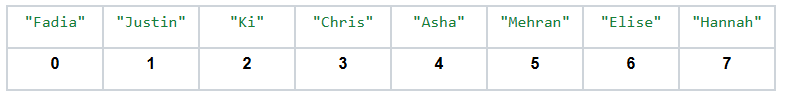
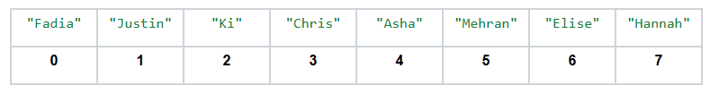

# Lists
## Quest
Can you do me a favor? I'm organizing a marathon, and I need you to write down how long the winner took to finish the race and store that as a variable. Actually, I need you to time the first 10 finishers, so you'll have to create ten variables (one for each runner). Actually... I want you to keep track of all the runners. There are 2000 of them! You can imagine how crazy it would be to define and keep track of 2000 variables! We're going to need a better system for efficiently storing large amounts of data like this. Lucky for you, I've got just the thing!

When we store a piece of data for our code to use later, we assign that value to a variable. Sometimes, however, when there is a lot of related information to keep track of, it can get messy trying to make a bunch of variables for each singular piece of data. \
To store multiple values inside a single variable, and the first is known as a `list`.

## Lists
It was a list of things to do or a list of groceries to buy from the store. Lists are just a collection of multiple pieces of information stored in a particular order. \
In Python, lists are no different! You can think about a `list` in Python as a table of values. Each value is labeled sequentially to give you a sense of how the data is ordered. These values start with the integer 0 and count up. Below is an example of a list of names!



The number below each name represents that item's `index` or placement in the list. The item at index 0 is the first element of the list, followed by the item at index 1, followed by 2, and so on. 

*Wait? Why do we start with a 0? Wouldn't it make more sense to start with 1 as the first index???*

There are several reasons for this, and it has to do with some mathematics and the way computers are designed. It'll take some getting used to, but Python is a `0-indexed language`, meaning anytime something in Python involves an index, the first element is going to start at index 0. \
This means the index of every item in the list is one less than its actual place in the list. It's confusing, we know, but it's also important that you realize this now before we start using lists in our programs.

## A New Type of Data
A `list` is an example of a new type of data we haven't seen before called a `container`. \
While each container is a new type, the job of the container is to store one or more other pieces of data. A list might have an int, float, str, or even another list inside of it.

### Mutability
Primitive types, like int, float, and str, are `immutable`, meaning they cannot be edited or `mutated`.

What exactly do we mean by *edited*?

To demonstrate this, let's assign the integer 6 to a variable
```python
my_favorite_number = 6
```

Now, I want you to *edit* that `6` in some way. Maybe you suggest that we double it. Let's do that!

```python
my_favorite_number = 6

# Now my_favorite number is 12
my_favorite_number *= 2
```

We just edited `6` to make it `12`... right? Not exactly.

`6` is an integer, and so is `12`. Both are separate, immutable pieces of data. \
In the code above, we took the integer 6 and assigned it the name `my_favorite_number`. When we multiplied `my_favorite_number` by `2`, here's what *really* happened. \
Instead of actually doing anything to the integer `6`, Python just grabbed the integer `12` and assigned that to `my_favorite_number` instead. You can't edit a `6`; it's just a `6`. \
When we change the value of a variable that is an immutable type, we are actually just assigning that variable to an entirely new piece of data.

Lists are mutable because you can edit what is inside them without creating a whole new list.

## Defining Lists
How do we create one of these fancy lists in Python? There are many ways to do it, and below are examples of a few common ones:

### *Defining a list of known values:*
```python
# Individual elements are seperated by commas
name_of_list = [item1, item2, item3]
```

### *Defining a list of a certain size with default values*
```python
# This creates a list where every element is equal to initial_value. The number of
# elements in that list is equal to size
name_of_list = [initial_value] * size
```

### *Defining an empty list:*
```python
name_of_list = []
```

Here, the square brackets [ ] are used to signify that the data we are working with is a list. These brackets appear when we try to print a list as well!

```python
'''
this program stores the names of several dogs in a list and then prints that
list to the console
'''
def main():
    my_dogs = ["Tyler", "Paisley", "Charlie", "Cooper", "Sam"]
    print(my_dogs)

if __name__ == '__main__':
    main()
```
=> Run >_Show

## Accessing List Elements
So, we've made a list and it has all these values in it. How do we get them out? When you want to view an element inside a list, you look that value up using its index! Recall the list of names we wrote out above:



Say we wanted to get the name `"Chris"` from this list. To do so, you would ask the list for the element stored at index 3, and the list would return the string "Chris"! To do this in Python, we use those brackets `[ ]` again, but in a slightly different way.

The template for accessing an item in a list looks something like this:
```python
name_of_list[index_of_element]
```

The brackets are attached to the end of the name of the list, indicating to the computer that we are attempting to access an element of that particular list. Between the brackets, we put the index of whichever element we want the computer to go and get for us.

Let's try to get the name `"Chris"` out of our list of names, but this time we're going to do it in Python!

```python
# Here is our list of names
names = ["Fadia", "Justin", "Ki", "Chris", "Asha", "Mehran", "Elise", "Hannah"]

# I want the name "Chris" which is at index 3
current_name = names[3]

# Let's print this to make sure we actually got the right value
print(current_name)
```
=> Run >_Show

It is easy to forget that each element's index is one less than its place in the list, so always double-check when writing your code that you are accessing the correct element. Also, if you try to access an element at an index that is not in the list, you will get an 🛑 Error!

```python
# Here is our list of names
names = ["Fadia", "Justin", "Ki", "Chris", "Asha", "Mehran", "Elise", "Hannah"]

# The highest index of this list is 7, but let's ask for the element at index
# 8

# What could possibly go wrong?
current_name = names[8]

# We'll never get this far :(
print(current_name)
```
=> Run >_Show

## Editing a List
When we use the bracket notation to access an element of a list, we are peering inside the list and getting direct access to that data. We can do more than just read values from a list; we can edit those values too! \
This right here is what makes lists mutable. If we want a list to change, we don't have to create a whole new list. We can just go inside the list we already have and change some of the information it contains.

When you want to assign a new value to a variable, you write that variable's name followed by an equals sign and the new value. To edit an item in a list, we do the same thing just with bracket notation:

```python
# Here is a list of my three favorite fruits
favorite_fruits = ["Strawberries", "Blueberries", "Apples"]

# Ooh, but I just had my first papaya and I LOVED it!!! I think I liked it more
# than I like Apples, so I want to replace "Apples" with "Papayas" in my list

# Apples is at index 2, so we want to edit favorite_fruits[2]
favorite_fruits[2] = "Papayas"

# Did it work?
print(favorite_fruits)
```
=> Run >_Show

## Slices

Sometimes you need access to a portion of an entire list. Python allows you to request a sublist, also known as a `slice` of a list, using the square brackets.

To take a slice of a list, use the square brackets in the following way:
```python
name_of_list[beginning:end]
```


This code means, "Give me all the elements between the index `beginning` and the index end." *However, be careful!* The element at index `beginning` is included in the slice, but the element at index `end` is *not*! \
The slice will contain every element from `beginning` up to but not including end. If, as an example, I want my slice to include the item at index 3, then my slice should go to index 4 so that 3 is included.

Let's see this in action:

```python
# We start with a list with a total of 5 elements
# The first index is 0 and the last index is 4
letters = ["A","B", "C", "D", "E"]

# We want the elements "B", "C", and "D"
# "B" is at index 1 and "D" is at index 3
# So we get the slice from index 1 to index 4
print(letters[1:4])
```
=> Run >_Show

Say you wanted a slice that starts at index 0. If you remove `beginning` from the brackets but leave the colon and end, Python will start the slice at 0 by default.
```python
name_of_list[:end]
```

Check this out below:
```python
# We start with a list with a total of 5 elements
# The first index is 0 and the last index is 4
letters = ["A","B", "C", "D", "E"]

# We want the first 3 elements "A", "B", and "C"
# "A" is at index 0 and "C" is at index 2
# So we get the slice from index 0 to index 3
# [:3] means everything from index 0 up to but not including 3
print(letters[:3])
```
=> Run >_Show

The same goes for a slice that ends at the final index of the list. If you remove the end from the brackets but leave the `beginning` and the colon, Python will end the slice at the last item of the list.
```python
name_of_list[beginning:]
```

As an example:

```python
# We start with a list with a total of 5 elements
# The first index is 0 and the last index is 4
letters = ["A","B", "C", "D", "E"]

# We want the last 2 elements "D", and "E"
# "D" is at index 3 and "E" is at index 4 (the end of the list)
# So we get the slice from index 3 to index 5
# [3:] means everything from index 3 all the way to the end of the list
print(letters[3:])
```
=> Run >_Show

If we didn't use this shorthand, getting the last two elements from the list above would require taking a slice from index 3 to index 5. This may seem strange because the list only goes up to index 4. Part of the benefit of using the shorthand is that you don't need to think about this. Since end is not included in the slice, the value of end needs to be one more than the last index if you want the slice to include the last element.

## Adding and Removing Elements
To add an element to the end of a list, we use the append function:

```python
colors = ["Red", "Yellow", "Orange"]
colors.append("Green")
print(colors)
```
=> Run >_Show

This is a special function that is a part of the list itself. This is why we have to connect the name of the function to the list with a period. You saw these in the graphics section, where functions were attached to the `canvas` variable because they are acting on that particular canvas we create. 

To remove an element, we use the remove function:

```python
colors = ["Red", "Yellow", "Orange"]
colors.remove("Red")
print(colors)
```
=> Run >_Show

If you try to remove an element that appears multiple times in the same list, Python will only remove the first instance of that element:

```python
colors = ["Red", "Yellow", "Red"]
colors.remove("Red")
print(colors)
```
=> Run >_Show

## Finding Elements in a List
There are a couple of ways to search a list for a particular item!

To check whether an item is contained in a given list, we use the keyword `in`:

```python
colors = ["Red", "Yellow", "Orange"]

my_color = "Red"

# This logical expression reads "my_color is an element in the list colors"
if my_color in colors:
    print(my_color, "is in the list!")
else:
    print(my_color, "is not in the list!")
```
=> Run >_Show

To find the index of a specific element in the list, we use the index function:

```python
colors = ["Red", "Yellow", "Orange"]

my_color = "Red"

red_index = colors.index(my_color)
print("Red is at index", red_index)
```
=> Run >_Show

---
Two important things to note about the index function:
1. If the item you are looking for appears more than once in the list, the `index returned` is the index of the first occurrence of that element.


```python
colors = ["Red", "Red", "Red"]

my_color = "Red"

red_index = colors.index(my_color)
print("Red is at index", red_index))
```
=> Run >_Show

2. If the item you are looking for is not in the list, the program will crash and you will get an 🛑 Error!

```python
colors = ["Red", "Yellow", "Orange"]

my_color = "Blue"

red_index = colors.index(my_color)
print("Red is at index", red_index)
```
=> Run >_Show

## Size of a List
To get the number of elements contained in a list, we use the `len` function. Unlike functions such as append and index, which are attached to the name of the list with a period, `len` is a function that takes the list in an argument:

```python
colors = ["Red", "Yellow", "Orange"]
size_of_list = len(colors)
print("The list has", size_of_list, "elements in it.")
```
=> Run >_Show

## Looping over a List
If you just print a list, you'll see all of its elements in the console:

```python
integers = [10, 4, 1, 3, 2]
print(integers)
```
=> Run >_Show

This doesn't let you do anything with the data in the list; it just prints it out. What if we wanted our code to do something for every element of the list?

We can access each element of a list using a for-loop. To do this, we loop over a range up to the size of the list. In each iteration of the loop, we access the element at index i (the iterator from the for loop).

```python
# We have a list of positive integers
integers = [10, 4, 1, 3, 2]
size_of_list = len(integers)
for i in range(size_of_list):
    print(integers[i])
```
=> Run >_Show

## Lists Can Store Anything

Seriously, you can put data of any type inside a list. They don't even need to all be the same type! 

```python
# This is a perfectly valid list
mystery_box = [17, "A rabbit", False, 22.1]
```

Usually, we'll stick to one type of data per list, just so it's easier to work with.

## Nested Lists
Lists can even store other lists. These are called nested lists because one list sits inside of the other:

```python
# Here are my favorite colors
colors = ["Cyan", "Purple", "Yellow"]

# These are my favorite foods
foods = ["Spaghetti", "Jollof", "Pupusas", "Pad Thai"]

# And these are my favorite animals
animals = ["Pandas", "Lions", "Elephants"]

# Now, I'm going to make a list that contains all my lists
favorites = [colors, foods, animals]


# What do you think this will do?
print(favorites[0])
```
=> Run >_Show

At each index of `favorites`, there is another list. Each of these lists has its own elements. If you wanted to get the entire list of colors, you would access the index of `favorites` where `colors` is placed. That's why the code above prints the list of colors. `colors` is the item at index 0 in `favorites`.

If you want a specific item within a nested list, you have to use two sets of square brackets.
```python
item = outer_list[index_of_inner_list][index_of_item_in_inner_list]
```

The first set of brackets tells Python which list you want to open, and the second set of brackets tells you which index from that inner list to pull from:

```python
# Let's define the big favorites list again
colors = ["Cyan", "Purple", "Yellow"]
foods = ["Spaghetti", "Jollof", "Pupusas", "Pad Thai"]
animals = ["Pandas", "Lions", "Elephants"]

favorites = [colors, foods, animals]


# Now, I want to pull "Pupusas" out from the foods list!
# foods is at index 1 in favorites and "Pupusas" is at index 2 in foods

# So this is how we write that in code
print(favorites[1][2])
```
=> Run >_Show

## Negative Indices
Using a negative-valued index when accessing elements of a list wraps around to the end of the list:

```python
# Let's define a list of colors
colors = ["Red", "Yellow", "Orange", "Green", "Purple", "Blue"]

# I want the second to last item in the list. There are a few ways to get it

# Option 1: We just know "Purple" is at index 4
elem_from_index = colors[4]

# Option 2:  We can calculate the second to last index using len
last_index = len(colors) - 1 # Remember to subtract 1 since lists are 0-index
elem_from_len = colors[last_index-1]

# Option 3: We use a negative index. [-2] means "The second to last element"
elem_from_neg_index = colors[-2]

print("Element Retrieved Using Index:", elem_from_index)
print("Element Calculated From Size of List:", elem_from_len)
print("Element Retrieved Using Negative Index:", elem_from_neg_index)rite that in code
print(favorites[1][2])
```
=> Run >_Show

You can also use negative indices to get a slice of a list:

```python
# Let's define a list of colors
colors = ["Red", "Yellow", "Orange", "Green", "Purple", "Blue"]

# I want the last 3 items of the list. There are a few ways to get them

# Option 1: We just know that the last three items start at index 3
slice_from_index = colors[3:]

# Option 2: We can calculate the third to last index using len
last_index = len(colors) - 1 # Remember to subtract 1 since lists are 0-index
slice_from_len = colors[last_index-2:]

# Option 3: We use a negative index. [-3:] means "Take a slice starting at the 
# third to last element"
slice_from_neg_index = colors[-3:]

print("Slice Retrieved Using Positive Index", slice_from_index)
print("Slice Retrieved From Using Size of List", slice_from_len)
print("Slice Retrieved Using Negative Index", slice_from_neg_index)
```
=> Run >_Show