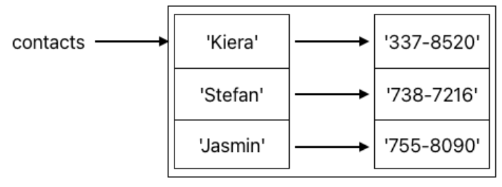

# Dictionaries
## Quest
Lists are a handy tool in Python, and you will likely use them often. Building on our momentum from the last two sections, we are going to go right into your second container: dictionaries! 

When you see the word **dictionary** you might think of something like this: 

## Dictionary of Python Terms:

### animation loop (noun) 

> a while loop used to repeatedly update a graphics window or canvas to produce    the appearance of movement 

### nested (adjective)

> structures or statements arranged in a hierarchy (one within another)

### return (verb)

> 1. to end a function 
> 2. to give back a value (called the return-value) in the context of a function

Real-life dictionaries are essentially a bunch of words, each paired with a corresponding definition. In Python, dictionaries are similar. They refer to **key-value pairs** where: 

* the **key** is some unique identifier 
* the **value** is something we associate with that key

An example you might be familiar with would be the list of contacts on your phone or in your phonebook. The keys would be the names of the people, and the values would be the corresponding phone numbers. \
So, how do we create dictionaries in Python? Let's look at the syntax with a few examples below: 

```python
contacts = {'Kiera': '337-8520', 'Stefan': '738-7216', 'Jasmin': '755-8090'}
```

As you can see, there are a few things to note about the syntax of dictionaries:
1. Dictionaries start and end with curly braces `{}` 
2. Between each key and the corresponding value is a colon `:` 
3. Each pair is separated by a comma `,` 

Conceptually, the image below is what the above line of code does.  contacts refers to the container as a whole where each key is mapped to the corresponding value: 



In the above example, both the keys and the values were all strings, but this doesn't have to be the case. \
So, what datatypes can we assign to keys and values? 

Keys must be **immutable** types. These are things like int, float, str, and bool.  

Values can be **mutable** or **immutable**. For example, you can have lists as values or even other dictionaries as values. 

## Building up a Dictionary 
If we don't know what we want to put in a dictionary when we declare it, we can start with an empty dictionary. 

```python
empty_dict = {}
```

If we want to add a value, we can do so like this: 

```python
final_grades = {}
final_grades['Viktor'] = 90    # final_grades now stores {'Viktor': 90}
```

We use square brackets `[]` to access things in the dictionary just like we do with lists. Unlike with lists, we retrieve values from a dictionary by giving the corresponding key instead of an index.\
If you try to assign a value to a key that has not yet been added to the dictionary like we do above will not cause an error. Instead, the computer adds the new key to the dictionary and assigns the value you gave to that new key.

We update the value in a key-value pair in the same way that you would a normal variable: 

```python
def main():
    # Start with an empty dictionary
    car_info = {}

    # Populate the dictionary with information about the car
    car_info["year"] = 2004
    car_info["color"] = "Blue"
    car_info["crashed?"] = False
    car_info["kilometers"] = 41312

    # Print the whole dictionary
    print("Initial Car Info")
    print(car_info)

    # Update the cars information
    car_info["kilometers"] += 100 # The car was driven an additional 100km
    car_info["crashed?"] = True # The car has been in an accident

    # Print the updated dictionary
    print("Updated Car Info")
    print(car_info)

if __name__ == '__main__':
    main()
```
=> Run >_Show

Reassigning a value to an existing key does not create a new key-value pair. It replaces the old value in the existing pair with the new value. \
For example, the line `car_info['crashed?'] = True` replaces the value `False` inside of `car_info` with `True`. `car_info` still only has one key called `'crashed?'`. On the other hand, values are allowed to have duplicates. 

Another thing to note about keys: if you try to access a key that doesn't exist in the current directory (outside of assigning it a value), you will get an error 🛑: 

```python
def main():
    # fill final grades dict
    final_grades = {}
    final_grades['Viktor'] = 88
    final_grades['Paola'] = 92
    final_grades['Ella'] = 92
    final_grades['Yasser'] = 97
    
    # what if we forgot to add someone's grade to the dict?
    print(final_grades['Cyrus'])
    

if __name__ == '__main__':
    main()
```
=> Run >_Show

To prevent this error, we can check to see if a key is in the dictionary before we try and access its value using the in keyword. 

```python
def main():
    # fill final grades dict
    final_grades = {}
    final_grades['Viktor'] = 88
    final_grades['Paola'] = 92
    final_grades['Ella'] = 92
    final_grades['Yasser'] = 97
    
    # what if we forgot to add someone's grade to the dict?
    if 'Cyrus' in final_grades:
        print("Cyrus's grade: " + final_grades['Cyrus'])
    
    if 'Ella' in final_grades:
        print("Ella's grade: " + str(final_grades['Ella']))


if __name__ == '__main__':
    main()
```
=> Run >_Show

## Nested Dictionaries
Let's say we wanted to implement a contacts app for phones (like our contacts dictionary from earlier). In addition to phone numbers, we also want each contact to be able to store other information like emails, birthdays, etc. We could do so like this: 

```python
def main():
    # you can build the nested contacts dict directly...
    contacts = {'Kiera': {'number': '337-8520', 'birthday': '2 March',
                          'email': 'kgomez4@gmail.com'}}
    
    # or add key-value pairs later just like with regular values
    contacts['Stefan'] = {'number': '738-7216', 'birthday': '24 July'}
    contacts['Jasmin'] = {'number': '755-8090', 'email': 'jas.shah@gmail.com'}
    
    # to access the inner dictionary elements, use second set of brackets
    contacts['Jasmin']['birthday'] = contacts['Stefan']['birthday']
    
    print(contacts)
    
    
if __name__ == '__main__':
    main()
```
=> Run >_Show

## Mutability
As we said before, nested dictionaries like the one above are only possible because values can be mutable. Dictionaries and lists are both examples of mutable types. \
In the last section, we described this as a new kind of variable type, which, unlike immutables, could be changed or altered (for both lists and dictionaries, this is accomplished using bracket notation). But is that all that mutability means? It turns out that mutability also affects arguments to functions. \
In the section on scope, we showed you that if you passed a variable as an argument to a helper function, that variable would remain unchanged in the original function (without returning and reassignment). \
What we didn't tell you is that this is only true for immutable variable types. Mutable types like lists and dictionaries will change if you pass them into a function. 

Consider the following example using our contacts app. Now that we've updated the contacts app to keep track of more information for each contact, we want to allow users to add new contacts. We could use a helper function for that: 

```python
def add_contact(contacts, name, number, birthday=None, email=None):
    '''
    builds a contact based on the given info and then adds it to contacts
    params:
        name (str): name of the contact
        number (str): phone number of the contact
        birthday (str or None): birthday of the contact (optional)
        email (str or None): email of the contact (optional)
    '''
    contact = {'number': number}
    
    # birthday and email are 'optional' arguments because they have 
    # default values, but we don't want None in our contacts dict
    if birthday != None :   
        contact['birthday'] = birthday
    
    if email != None : 
        contact['email'] = email
        
    contacts[name] = contact
    # notice how we don't return contact


def main():
    contacts = {}
    
    # add the three contacts using our helper function
    add_contact(contacts, 'Kiera', '337-8520', 
                '2 March', 'kgomez4@gmail.com')
    add_contact(contacts, 'Stefan', '738-7216', '24 July')
    add_contact(contacts, 'Jasmin', '755-8090', 
                email = 'jas.shah@gmail.com')
    
    print(contacts)
    
    
if __name__ == '__main__':
    main()
```
=> Run >_Show

Even though contacts isn't returned, the helper function still updates contacts in main. Mutability is useful because it allows us to edit dictionaries and lists without having to return them and reassign them every time, but it can also be tricky. Sometimes, you might want to write a function that takes in a dictionary as a parameter in order to read from it, but not alter it. If you aren't careful, you could end up with a bug in your code that changes the dictionary in the helper function thereby changing the original dictionary from the caller function. 

It is not just arguments that mutability affects either. Look at the code below: 

```python
def add_contact(contacts, name, number, birthday=None, email=None):
    '''
    builds a contact based on the given info and then adds it to contacts
    params:
        name (str): name of the contact
        number (str): phone number of the contact
        birthday (str or None): birthday of the contact (optional)
        email (str or None): email of the contact (optional)
    '''
    contact = {'number': number}
    
    if birthday != None :   
        contact['birthday'] = birthday
    
    if email != None : 
        contact['email'] = email
        
    contacts[name] = contact


def main():
    contacts = {}
    
    add_contact(contacts, 'Kiera', '337-8520', 
                '2 March', 'kgomez4@gmail.com')
    add_contact(contacts, 'Stefan', '738-7216', '24 July')
    add_contact(contacts, 'Jasmin', '755-8090', 
                email = 'jas.shah@gmail.com')
    
    # assign 'Jasmin' dict to a new variable 
    jasmin = contacts['Jasmin']
    
    # change new variable
    jasmin['email'] = 'new_email@gmail.com'
    
    # contacts will be affected as well
    print(contacts['Jasmin'])
    
    
if __name__ == '__main__':
    main()
```
=> Run >_Show

As you can see, changing jasmin also changed `contacts`. This is different from the behavior we saw from variables in `basic arithmetic`. \
Any assignment reference to a dictionary or list (or other mutable type) will exhibit this behavior.

## Useful Functions with Dictionaries
Let's look at some useful functions for dealing with dicts. 

### *Deleting Key-Value Pairs*

```python
def main():
    squares = {1: 1, 2: 4, 3: 9, 4: 16, 5: 25}
    
    # dict.pop(key) deletes the key-value pair and returns value
    deleted = squares.pop(2)
    print('1st deleted value: ' + str(deleted))
    print('deletion 1: ' + str(squares))
    
    # del dict[key] deletes the key-value pair and returns nothing
    del squares[4]
    print('deletion 2: ' + str(squares))
    
    # dict.clear() deletes every key-value pair and leaves an empty dict
    squares.clear()
    print('deletion 3: ' + str(squares))
    
    
if __name__ == '__main__':
    main()
```
=> Run >_Show

### *Looping Over Key-Value Pairs*
There are a few ways to loop over the key-value pairs in a dictionary. 

```python
def main():
    grocery_list = {'apples': 5, 'chicken': 1, 'tomato sauce': 1,
                    'rice': 2, 'garlic': 1, 'milk': 2, 
                    'eggs': 1, 'carrots': 2}

    grocery_prices = {'apples': 0.75, 'chicken': 4.79, 
                      'tomato sauce': 1.59, 'rice': 1.99, 
                      'garlic': 1.89, 'milk': 3.99, 'eggs': 5.99,
                      'carrots': 2.89}
    
    # you can loop through the keys in a dictionary using dict.keys()
    total_price = 0
    for key in grocery_list.keys():
        # accessing grocery_prices[key] only works because the two dictionaries 
        # have identical keys
        total_price += grocery_list[key] * grocery_prices[key]
    print('grocery bill: ' + str(total_price))
    
    # you can also loop through the keys in a simpler way
    most_expensive_item = 'apples'
    for key in grocery_prices:
        if grocery_prices[key] > grocery_prices[most_expensive_item]: 
            most_expensive_item = key
    print('most expensive item: ' + str(most_expensive_item))
    
    # you can loop through the values using dict.values()
    grocery_count = 0
    for value in grocery_list.values():
        grocery_count += value
    print('number of groceries bought: ' + str(grocery_count));

    # lastly, you can loop over both using dict.items()
    for key, value in grocery_list.items():
        if value >= 5:
            print("Wow, we need a lot of", key)
        

if __name__ == '__main__':
    main()
```
=> Run >_Show

An important thing to note about looping through keys with nested dictionaries: the keys in the inner dictionaries will not be iterated over. You must use nested loops to get to the inner keys (nested loops for nested dictionaries). 

Another important thing to note is that the functions `dict.keys()`, `dict.values()`, and `dict.items()` do not return lists. \
What they do return is not all that important (but it is similar to what the `range` function returns). What is important is that we have a way to turn their return values into lists when we need to: the `list` function. \
The `list` function is just like every other type conversion function we have learned about. You can see it in action below:

```python
def main():
    grocery_list = {'lemons': 3, 'apple juice': 1, 'spaghetti sauce': 1,
                    'noodles': 2, 'grape juice': 1, 'milk': 2, 
                    'strawberries': 1, 'honey': 2}
    
    print(list(grocery_list.keys()))
    print(list(grocery_list.values()))
    print(list(grocery_list.items()))
    
if __name__ == '__main__':
    main()
```
=> Run >_Show

*Side note: you may have noticed that dict.items() function seemed to output key-value pairs in parentheses like this: (key, value)*

### *Other Functions*

```python
def main():
    # dictionary of playlists (lists of song titles)
    playlists = {'throwback': ['Dynamite', 'Titanium', 'Hey Ya!', 'Rather Be'],
                 'rnb': ['Sure Thing', 'This is', 'Best Part', 'Talk'],
                 'international': ['Drogba (Joanna)', 'Gasolina', 'Kiminomama']
    }
    
    # dict.get(key) returns the value associated with key or None if the key 
    # doesn't exist
    rnb = playlists.get('rnb')
    sad_music = playlists.get('sad') # this doesn't exist
    print(rnb)
    print(sad_music)
    
    # dict.get(key, default) returns the value associated with key or default
    # if key doesn't exist
    sad_music = playlists.get('sad', [])
    print(sad_music)
    
    # len(dict) returns the number of key-value pairs
    print('number of pairs: ' + str(len(playlists)))
    
    
if __name__ == '__main__':
    main()
```
=> Run >_Show

Just like `dict.keys()` and `dict.values()`, for nested dictionaries, the `len` function only returns the number of key-value pairs in the outer dictionary. 