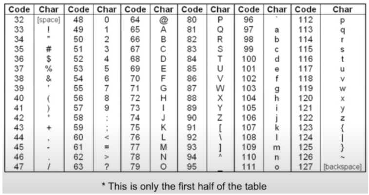
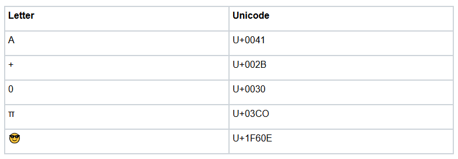
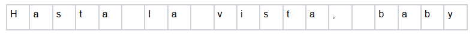
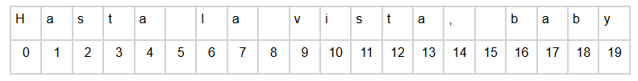

# Strings
## Quest 
We have been using this datatype for some time now—since the variables section in fact—but now it is time to take a little bit of a deeper dive into the world of **strings**. \
After all, many of the examples we have seen with dictionaries in the last section involved strings as keys, and being able to work with and manipulate strings will prove very useful when we get into file reading. So, without further ado, let's get started!

## Characters
Strings can be thought of as sequences of **characters**, but there isn't a *character* data type in Python. Still, it's worth understanding how individual characters are represented within a larger string. 

There are so many different symbols you can write on a computer. Even though Python is written with English keywords and letters, there are plenty of other symbols out there. 

## *Examples of Single Characters:*

### *Symbols:*

```python
letter_a  = 'A'
plus      = '+'
zero      = '0'
space     = ' '
greek_pi  = 'π'
emoji     = '😎'
```

### *Escape Characters:*

```python
new_line  = '\n'
tab       = '\t'
backslash = '\\'
backspace = '\b'
```

## ASCII
The American Standard Code for Information Interchange, also known as `ASCII`, is the most popular encoding format for storing text on computers. Each character is associated with a unique number according to the following table: 



*Credit: Using portions of slides by Eric Roberts*

A link to the full ASCII table can be found [here.](https://www.asciitable.com/)

## Unicode
As you'll notice, ASCII doesn't cover nearly all of the characters you could write. There are no emojis, and letters from most other languages are missing. \
Even some of the characters we listed above are not included in the ASCII table. To cover a broad range of characters, Python supports Unicode, a much more robust encoding format that covers far more characters than ASCII does. The identifiers for each symbol look like U+ followed by some letters and numbers. Here are a few examples: 



Most of the time, you won't have to deal with these codes yourself. You can just copy and paste the symbol you want into your code, and Python will handle its Unicode value for you. 

## What is a String? 
Characters are the building blocks of strings. After all, way back in Intro to Python, when we first introduced you to the concept of variable types and strings, we defined them as `text or character sequences between "" or ''`\
. Let's expand on this definition. Specifically, let's expand on what we mean by *character sequence*. 

```python
Consider this string: "Hasta la vista, baby" 
```

If we were to visually represent that as a sequence of characters, it would look something like this: 



This looks kind of like a list! Strings can be thought of as like a special type of list of characters. We can even index through strings the same way that we index through lists (using square brackets []). 



### REPL

```python
$ python
>>> quote = "Hasta la vista, baby"
>>> quote[9]
v
```

We can also use colons to get string slices the same way that we get list slices. A string slice is called a **substring**. 

```python
def main():
    quote = "Hasta la vista, baby"
    first_word = quote[0:6]
    print(first_word)

if __name__ == '__main__':
    main()
```
=> Run >_ Show

## Strings are Immutable
Now there is a reason we said that strings are like a kind of list. Immutable types are things like ints, floats, bools, and strings. We also said that lists and dictionaries are both examples of mutable types. \
This difference in mutability is an important one. It means that we cannot explicitly edit a string as we please. If we try to do so, we will get an error 🛑: 

```python
def main():
    quote = "I'm the king of the world!"
    quote[20] = 'W'
    print(quote)


if __name__ == '__main__':
    main()
```
=> Run >_ Show

While we can't explicitly edit strings, as we saw in `variables` and `basic arithmetic`, we can reassign or concatenate them to get the results that we want. As a reminder, string concatenation is when we 'glue' two strings together using the `+` operator. 

```python
def main():
    quote = "Where is Gamora?"
    print(quote)
    quote = "Who" + quote[5:]
    print(quote)
    quote = "Why" + quote[3:]
    print(quote)
    

if __name__ == '__main__':
    main()
```
=> Run >_ Show

Each update to quote is a reassignment which essentially creates a new string based on the slices and concatenation (as opposed to altering the original). This is why, even though strings are immutable, we can still do operations like string concatenation. 

As an aside: the shortcut operation that we discussed in `basic arithmetic` also works for string concatenation:

```python
def main():
    quote = "Bueller..."
    quote += quote + quote
    print(quote)
    

if __name__ == '__main__':
    main()
```
=> Run >_ Show

## Useful Functions Part 1
Aside from concatenation, there are also several other useful operations and functions that Python gives us for working with strings. Let's look at a couple below: 

```python
def main():
    # len(str) returns the length of the given string
    quote = 'Hakuna Matata'
    print('length of', quote, '=', len(quote))
    
    # ord(char) takes in a single character and returns the associated unicode
    # value
    print('unicode for \'A\':', ord('A'))
    print('unicode for \'a\':', ord('a'))
    print('unicode for \'🥳\':', ord('🥳'))
    print('unicode for \'$\':', ord('$'))
    print('unicode for \'好\':', ord('好'))


if __name__ == '__main__':
    main()
```
=> Run >_ Show

#### Why do we need unicodes? 
Well, it turns out that Python uses them for another useful operation. If you use comparison operations on strings, Python will compare the Unicode values. \
You can use this to check string equality using `==` or to check the alphabetical order of two strings with `< >`. As we saw in the example above `'A'` and `'a'` have different unicodes, so you must be careful when comparing strings with different cases. 

```python
def main():
    # == checks the equality of two strings based on unicodes
    quote1 = "...shaken, not stirred."
    print('ex. 1', str(quote1 == '...shaken, not stirred.'))

    # case matters for equality
    print('ex. 2', str(quote1 == '...SHAKEN, NOT STIRRED.'))

    # < and > can be used to check alphabetical order
    exclamation1 = "excelsior"
    exclamation2 = "eureka"
    print('ex. 3', str(exclamation1 > exclamation2))

    # strings with different cases, punctuation and whitespace might interfere
    # with the accuracy of checking for alphabetical order
    quote2 = "Nobody move! I dropped me brain!"
    quote3 = "i've got a jar of dirt!"
    print('ex. 4', str(quote2 > quote3))

    # if one string is shorter than the other but equal otherwise, the shorter
    # string < longer string
    quote4 = "I don't have friends"
    quote5 = "I don't have friends, I have family."
    print('ex. 5', str(quote4 < quote5))


if __name__ == '__main__':
	main()
```
=> Run >_ Show

Last but not least, there is a very useful keyword in Python for determining if a string is a substring of another. We've seen this keyword before: the `in` keyword. 

```python
def main():
    quote = 'Hoo-hoo! Big summer blowout!'
    print('sum' in quote) # will print true
    print('Hoo!' in quote) # will print false (case sensitive)

if __name__ == '__main__':
    main()__ == '__main__':
	main()
```
=> Run >_ Show

## Looping over Strings

Putting a few of the things above together with our knowledge of for-each loops, we now have all of the tools we need to loop over a string!

Let's say that we want to create a function to reverse a string. We could do so in three ways: 

### Method 1: indexing using a for-loop

```python
def reverse_string(string):
    result = ""
    for i in range(len(string)):
        result = string[i] + result
    return result


def main():
    quote = 'You know what kind of plan never fails? No plan at all'
    print(reverse_string(quote))	


if __name__ == '__main__':
    main()
```
=> Run >_ Show

### Method 2: for each loop

```python
def reverse_string_v2(string):
    result = ""
    for ch in string:
        result = ch + result
    return result


def main():
    quote = 'I feel the need... the need for speed!'
    print(reverse_string_v2(quote))	


if __name__ == '__main__':
    main()
```
=> Run >_ Show

As you can see, you can loop over strings the same way that you loop over lists. Both for and for each loops work well and which one you choose depends on whether or not you want to know the index of a particular character as well. 

#### We did mention that there are 3 methods to reversing a string. Is there a third loop? 
No, but there is a clever way to use slice indexing to achieve the same result: 

### Method 3: (not a loop) fancy indexing

```python
def reverse_string_v3(string):
    '''
    This uses the slice operator in a special way. With no
    start, no end and a delta of -1, slice reverses.
    '''
    return string[::-1]


def main():
    quote = 'success के पीछे मत भागो, excellence के पीछे भागो'
    english_translation = "Don't run after success, run after excellence"
    print(reverse_string_v3(quote))
    print(reverse_string_v3(english_translation))	


if __name__ == '__main__':
	main()
```
=> Run >_ Show

## Useful Functions Part 2
These are several more functions that we feel are useful to know for working with strings. Unlike the previous functions and operators, all of these are *string functions* not just functions that use strings as arguments. These are divided into two parts: `must know` and `good to know`.

### *Must know*

```python
def main():
    # str.split(separator) returns a list of substrings 
    # substrings are determined by the separator
    quote = 'We have so much to say, and we shall never say it.'
    print('split:', quote.split(' ')) 

    # str.upper() returns str in all uppercase
    quote = 'Do or do not. There is no try.'
    print('upper:', quote.upper())

    # str.lower() returns str in all lowercase
    print('lower:', quote.lower())

    # str.replace(oldsubstr, newsubstr) replaces all instances of oldsubstr 
    # with newsubstr in str
    quote = "What's done is done when I say it's done."
    print('replace:', quote.replace('done', 'good'))

    # str.find(substr) returns the index of the first instance of a substr
    quote = "You didn't ask for reality; you asked for more teeth!"
    print('find:', quote.find('for'))

    # str.strip() leading and trailing whitespace
    quote = '   Sometimes your whole life boils down to one insane move    '
    print('strip:', quote.strip())
	
	
if __name__ == '__main__':
    main()
```
=> Run >_ Show

### *Good to know*

```python
def main():
    # str.startswith(substr) returns true if str begins with substr
    quote = "Thrones are for Decepticons. Besides, I'd rather roll."
    print('startswith:', quote.startswith('Th')) 

    # str.endswith(substr) returns true if str ends with substr
    quote = 'We could all have been killed... or worse, expelled.'
    print('endswith:', quote.endswith('end'))

    # str.title() returns str with the first letter of each word capitalized
    quote = "Give it up, Sid. You know humans can't talk"
    print('title:', quote.title())

    # str.isalpha() returns true if every character is alphabetic
    print('isalpha1:', 'Hello'.isalpha())
    print('isalpha2:', 'I Love Code!'.isalpha())

    # str.isdigit() returns true if every character is a numerical digit
    print('isdigit:', '173'.isdigit())

    # str.isspace() returns true if every character is whitespace
    print('isspace:', '  '.isspace())

	
if __name__ == '__main__':
	main()strip:', quote.strip())
	
	
if __name__ == '__main__':
    main()
```
=> Run >_ Show

## Worked Example - is_palindrome
We just threw a lot of new functions at you, so we thought it might be helpful to see a few of those functions in action. Let's say you wanted to implement a function.

For context, a palindrome is any string that is the same forward and backward such as `'abba', 'racecar', or 'kayak'.`

We can use our reverse function to implement it: 

```python
def reverse_string(string):
    result = ""
    for ch in string:
        result = ch + result
    return result


def is_palindrome(string):
    rev = reverse_string(string)
    return string == rev


def main():
    # This is a palindrome! It should return true.
    print(is_palindrome('Mr. Owl ate my metal worm.'))

    # We changed Mr to My. This should return false.
    print(is_palindrome('My Owl ate my metal worm.'))


if __name__ == '__main__':
    main()
```
=> Run >_ Show

Wait a minute! Why does the first call to `is_palindrome` not return True? Well, as we've said before, things like whitespace, punctuation, and case all matter when using `==` to check for equality. We need to find a way to get rid of all the extra characters and standardize the case. Let's use some string functions!

```python
def reverse_string(string):
    result = ""
    for ch in string:
        result = ch + result
    return result


def normalize(string): 
    normalized = ''
    for ch in string:
        if ch.isalpha():
            normalized += ch
    return normalized.lower()


def is_palindrome(string):
    normalized = normalize(string)
    rev = reverse_string(normalized)
    return normalized == rev


def main():
    # This is a palindrome! It should return true.
    print(is_palindrome('Mr. Owl ate my metal worm.'))

    # We changed Mr to My. This should return false.
    print(is_palindrome('My Owl ate my metal worm.'))


if __name__ == '__main__':
	main()
```
=> Run >_ Show