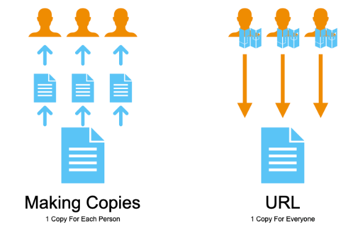
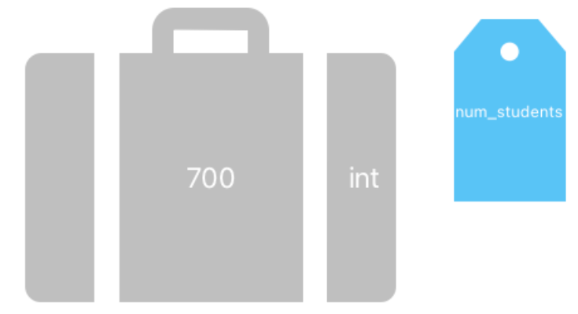
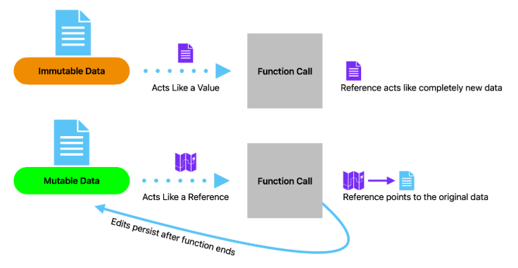

# Intro to References
## Quest
A magician never reveals their tricks, right? Well, we’re not magicians, we’re computer scientists. While a lot of what we do might, at times, feel like magic, there is always a logical explanation for why our programs do what they do. \
So, with that in mind, we are going to show you one of our tricks. It’s time to peek behind the curtain and see what’s really going on with variables and mutability!

## The URL Analogy
Right now, you are reading a document we wrote to teach you about Python. Where does this document live? \
You might be reading this offline or in some other format, but many readers found this page using a link to a website. This document lives online; it has a special URL or an address you can type into the internet that leads you to this page. 

Why do you think we chose to upload this document to the internet? We could’ve just sent a copy to everyone who wanted to read it, but there are two problems with that idea:

1. This document could potentially be read by thousands of students around the world. We’d have to make a copy for every single student and send it to them individually.
2. Say we wanted to fix a typo or add some additional content to the document. To make sure everybody has the most up-to-date version, we’d have to make thousands of new copies, again and again, each time we want to make a change.

Think about how much more efficient using a URL is!

1. Instead of making thousands of identical copies of the same information, there is just one document stored on our website.
2. Instead of sending you all the pages of information in this course reader, we just send you a short URL.

When we edit the course reader, nobody needs a new copy sent to them. Since they are coming to our website and looking at our document, the changes have already been made by the time they come knocking on our door.



The key idea is that it is much more efficient to tell someone where information is stored than to make a copy of that information and send it to them. \
Programmers realized this and decided it was worth building Python in a way that supports this idea of a URL. In Python, these URLs are called **references**.

## Memory
You have a brain. Part of that brain is responsible for helping you remember things. In a lot of ways, your computer is like a brain too. The part of your computer that remembers things is called **memory**.\ 
Computer has these little suitcases called **memory addresses** that store bits of information. \
When you assign a new variable, your computer picks an empty one of these suitcases and stores whichever value you gave inside that suitcase. That variable now serves as a luggage tag to help the computer identify where it stored your information so that it can retrieve it for you later.

Variables don’t actually store values. Rather, they just keep track of the memory address where the value is stored. Variables store a **reference** to the value because they refer your computer to the correct suitcase where the value is actually stored.

We do this for the precise reasons stated up above, and references become increasingly useful the more data you have. If you had a list of, say, 10,000 elements, passing a short memory address as an argument takes up far less space than copying the entire list and passing that instead. \
No matter how big your data gets, references will always stay the same size, making it easy to pass massive amounts of data between functions without much of a hassle! Also, if multiple variables reference the same list, editing the list for one variable edits it for all of them.

Let's go back to a variable example to understand how they really work:

```python
num_students = 700
```

We told you that you could think of `num_students` like a piece of luggage!



The image above was first shown in the `variables` section, though perhaps it makes more sense now, given what we just learned. \
The “luggage” tag -- the variable `num_students` -- doesn’t actually store the value `700`. Instead, `num_students` tells you where to find the correct suitcase.

## How Variables Act
In reality, all variables in Python store a reference to the data they are supposed to keep track of. When you pass a variable in as an argument, the information received by the corresponding parameter is just the reference to whatever value that argument stores. 

Sometimes, though, it feels like the value itself is being passed into the function. As it turns out, some of the data types you are more familiar with do act as if that is true, even if references are really what is going on under the hood.


All data types in Python are `passed by reference`, meaning the memory address is what gets passed. Here’s why this is important: if you pass a reference to a value as an argument and then edit that value within the function, that value has now been permanently changed.\
Using our example from before, this would be like editing our one shared copy of the textbook that everybody is reading. This behavior shows up most obviously with mutable data types. If I pass in a reference to a list and then change that list somehow, the original list gets changed too:

```python
def add_ending_to_list(list):
    '''
    this function takes in a reference to a list and appends a
    final element to the end
    params:
        list : reference to a list
    '''
    list.append("End of List")

def main():
    # We create a list of integers and store a reference to it
    # in the variable called numbers
    numbers = [1,2,3,4,5]

    # Then, we pass that reference to our helper function
    add_ending_to_list(numbers)

    # After the helper function is done, numbers still references
    # the same location in memory, but the list stored there has
    # been modified
    print(numbers)

if __name__ == "__main__":
    main()
```
=> Run >_Show

Notice how `add_ending_to_list` doesn’t return anything. Furthermore, notice how we just called `add_ending_to_list` by itself. Unlike the `x = change(x)` paradigm, dealing with mutable data just involves passing that data in and then modifying it how you wish. \
Once the function ends, your variable will already reference the newly updated information. The reason pass by `reference` works this way is that the argument is still referencing the same location in memory, but the value at the location in memory has changed.

#### What about immutable data types? 
While they are also passed by reference, immutable data types seem like they are `passed by value`. 

If you pass an integer in as an argument and then modify the value of the parameter, the value of the variable that was passed in is unaffected. \
Why this happens exactly is less important, but you just need to remember that you can’t modify the value of an immutable argument within a function and expect that argument to have changed:



```python
def double_it(number):
    '''
    this function takes in a reference to a number and doubles
    its value
    '''
    number *= 2

def main():
    # We store a 4 in memory and assign a reference to that 4 to 
    # the variable called number
    number = 4

    # Then, we pass that reference to our helper function
    double_it(number)

    # Even though we passed number by reference, its value is
    # not effected by what happens inside the function
    print(number)

if __name__ == "__main__":
    main()
```
=> Run >_Show

*Important: We say immutable types “seem” to be passed by value because they are actually passed by reference.*