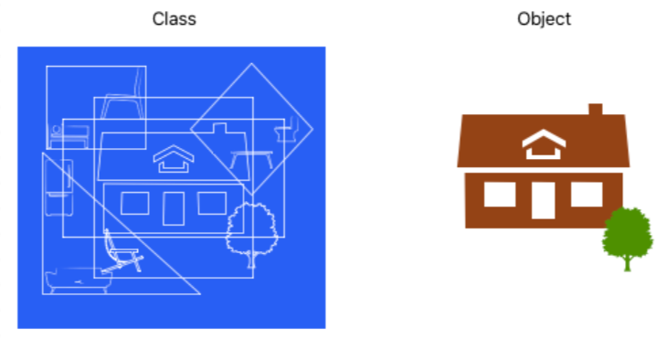
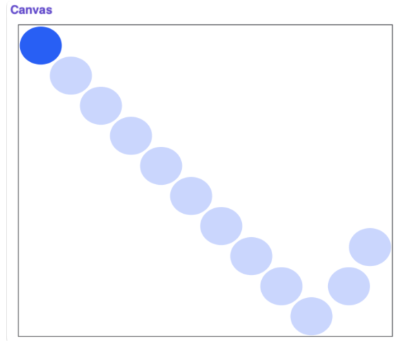

# Objects
## Quest
Now that we have a basic understanding of `references`, we are going to take a brief detour back to the graphics section. Remember when we had you create a canvas to display all of the cool graphics that you made? We had you do so like this...

```python
canvas = Canvas(CANVAS_WIDTH, CANVAS_HEIGHT)
```

...and then when you wanted to add something to the canvas, you would do something like this: 

```python
canvas.create_line(10, 20, 100, 50, 'red') 
```

We ignored the weirdness of this code earlier because you didn't need to know what was going on to create the graphics. But, what is going on? What variable type is canvas? \
It is certainly not any of the types we have talked about before (int, float, bool, string, list, dictionary, tuple). Somehow, we can do functions on it using a period?! And why does the Canvas function start with a capital letter? 

Well, it turns out that canvas is a special data type called an `object`. Before you can understand objects, you first need to know what `classes` are. \
Classes are essentially groups of data (called `instance variables`) and functions (called `methods`). \ 
List functions like `index` or `remove` are really list *methods*. The cool thing about classes is that we can create our own. For example, `Canvas` is a class created to allow your programs to display graphics.

`Objects` are *instances* of classes. Every time you create a list or dictionary variable, you are creating an instance of the list or dictionary class. 

You can essentially think of a class as a blueprint of a specific house and an object as a physical house that is built with the blueprint. There can be many houses built with the same blueprint and we can have many different instances or objects of one class. 



In the case of graphics, `canvas` is an object of the `Canvas` class. `create_line` is a method in the `Canvas` class that we can call on the `canvas` object. To call an object's method, we use the following notation that you have seen before: 

```python
object_name.method_name(arg1, arg2...)
```

The period in between the object and its method is called the `dot operator`. It ties the method from the particular class on the right to the specific object on the left. The same notation is used for instance variables: 

```python
object_name.instance_variable
```

## Mutation
Most custom objects or objects that you create will be mutable. It is possible to have or create an immutable object (like strings), but for the most part, we will not encounter those in this class. As we saw with lists and dictionaries, being mutable means that when you pass objects in as parameters to a function, the changes that you make in the helper function will affect the object in the caller function. 

Let's go back to our bouncing ball program to see this in action. If you remember from the animation section, the goal was to create a program where a bouncing ball would start at the top of the screen and "bounce" every time it hit an edge. 



The code below adapts our bouncing ball code from before with a helper function. 

```python
from graphics import Canvas
import time

BALL_SIZE = 50
CANVAS_WIDTH = 550
CANVAS_HEIGHT = 450
DELAY = 0.001       # seconds to wait between each update
START_X = 0
START_Y = 0

def make_ball(canvas): # make canvas object a parameter
    '''
    adds bouncing ball to the given canvas and returns it
    '''
    return canvas.create_oval(START_X, START_Y, BALL_SIZE, BALL_SIZE, 'blue')
    

def main():
    # setup
    canvas = Canvas(CANVAS_WIDTH, CANVAS_HEIGHT)
    ball = make_ball(canvas)
    change_x = 1
    change_y = 1
    
    # animation loop
    while(True): 
        left_x = canvas.get_left_x(ball)
        top_y = canvas.get_top_y(ball)
        
        # change direction if ball reaches an edge
        if left_x < 0 or left_x + BALL_SIZE >= CANVAS_WIDTH:
            change_x = -change_x
        
        if top_y < 0 or top_y + BALL_SIZE >= CANVAS_HEIGHT:
            change_y = -change_y
        
        # update the ball
        canvas.move(ball, change_x, change_y)
        
        # pause
        time.sleep(DELAY)
    
    
if __name__ == "__main__":
    main()
```
=> Run >_Show

As you can see, when canvas is passed in as a `parameter`, calling `create_oval` still displays an oval on the original `canvas`. 