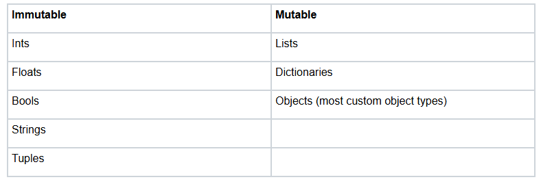
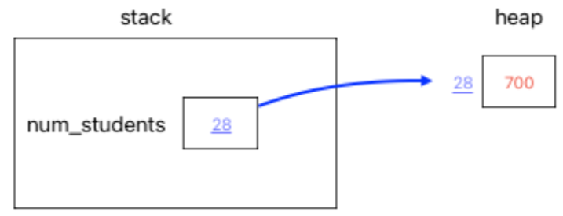
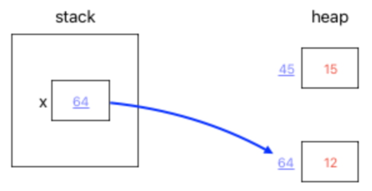
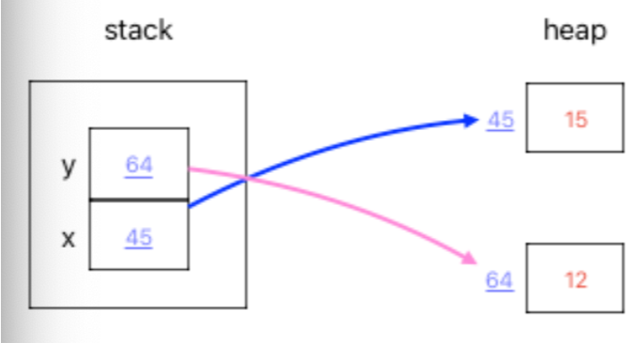
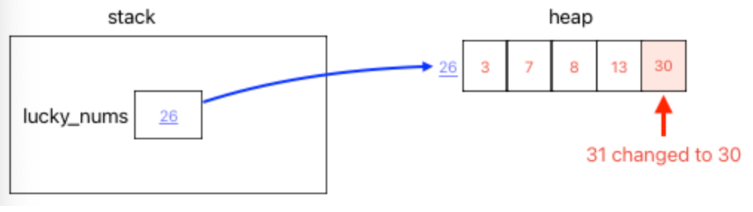
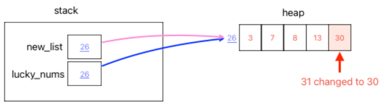

# Mutation
There are two categories of variable types: `immutable and mutable.`



Immutable types cannot be edited or mutated but are reassigned values. Mutated types can be edited. This affects how both of these variable types can be referenced. \
Immutable types are not changed by references such as assigning another variable to them or passing them in as arguments to functions. \
On the other hand, if a mutated type is assigned to another variable or passed into a function and then updated, the original variable will be affected as well. 

## Stack vs Heap 

The memory stack and heap are not super important for you to fully understand right now. We are going to give you a very low level overview to help make mutability and the URL analogy easier to understand. \
There are two general structures of memory that programs use. 
* The first is called the `stack` and it holds memory for the local variables (addresses) that you create in functions for a single program. 
* The second is called the `heap` and it holds memory (values) for all programs running on your computer. 

Let's visit our example from way back in the variables section again. 

```python
num_students = 700
```

As we said in the references section, the variable num_students is actually keeping track of the memory address of the value `700`. `num_students` (with the stored memory address) is stored on the stack. The memory address is actually the address or location of the value on the heap. \
In the example below, `28` represents the memory address. 



You might be wondering why we have two different areas of memory. Aside from allowing for mutability and immutability, it is also just a more efficient way to use memory. We can delete local variables from the stack once a function is over in order to save space, but we also want a separate space to make sure that things like global constants are not erased after the end of the first function. 

## Reassignment vs Mutation
Using our new depictions of the stack and the heap, we can now tell you what goes on behind the scenes for immutable and mutable variables. When you reassign a value to a variable, what you are really doing is changing the memory address that is stored in that variable: 

```python
x = 15
x -= 3
```



This is why we can do things like set a second variable y equal to x or pass x in as an argument to a function and any changes to the parameter in the function or to y will not affect x. y or the parameter will simply be assigned a new memory address with the new value, and the value at the memory address that x points to will remain unchanged. 

```python
x = 15
y = x
y -= 3
```



That is the case for immutable variables. What happens in memory for mutable types? \
As you might've guessed, with mutable variables like lists, edits to the internal values alter the memory on the heap. 

```python
lucky_nums = [3, 7, 8, 13, 31]
lucky_nums[4] -= 1
```



This means that when we set a new list equal to lucky_nums or pass lucky_nums in as an argument and then make changes, the changes affect lucky_nums as well. 

```python
lucky_nums = [3, 7, 8, 13, 31]
new_list = lucky_nums
new_list[4] -= 1
```

