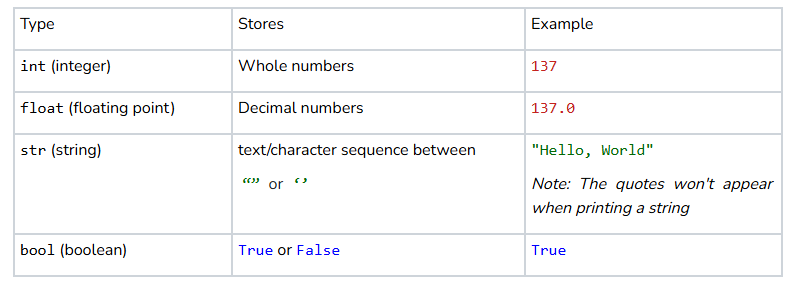
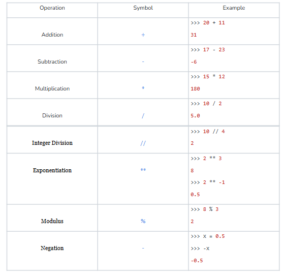
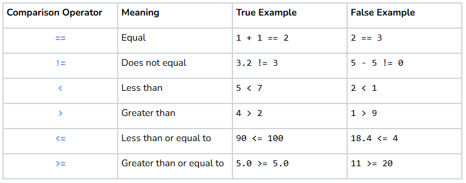
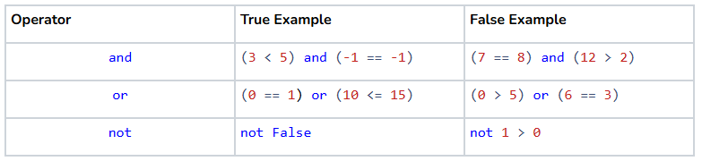
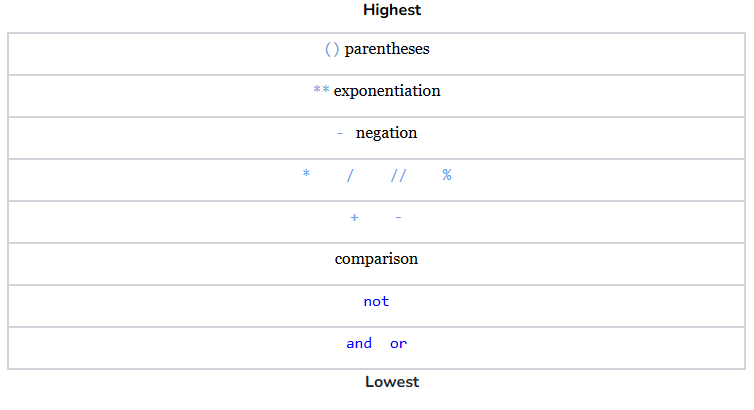

# Python Documentation
## Getting Started
Every program you write with us will always include the following code to define and execute a main() function:

```python
def main():
    # Your code goes here

if __name__ == '__main__':
    main()
```

```python
from karel.stanfordkarel import *

def main():
    move()
    move()

if __name__ == '__main__':
    main()
```
=> Run

## Variables
### *Assigning a Variable*

```python
variable_name = value
```

### *Accessing the Current Value of a Variable*

```python
message = "Hello, World!"

# message is replaced with its current assigned value, which is "Hello, World!"
print(message)
```

### *Variable Types*



## Print
### *Printing a string literal*

```python
# Remember to surround your message in single '' or double "" quotes
print("Hello, World!")
```
>= Run >_Show

### *Printing a variable*

```python
# Change the value of data and see what happens
data = 137.2

print(data)
```
>= Run >_Show

### *Multi-Argument Print:*

```python
name = "Kyler"

# Python automatically separates each argument with a space
print("Hello, my name is", name)
```
>= Run >_Show

## Input
### *Storing user input as a variable*

```python
user_input = input("This Message Will Is Displayed When Prompting The User For Input")
```

### *Storing numerical inputs*

```python
# input always returns a string by default, so you have to convert numerical inputs manually
integer_input = int(input("Enter an integer:"))

float_input = float(input("Enter a floating point value:"))
```

## Operators
### *Arithmetic Operations*


### *Comparison Operations*


### *Logical Operations*


*Writing expressions with variables* \
Expressions are evaluated before assignment. The right side of the = becomes a single value which then gets assigned to the variable name.

*Example Math Expression*
```python
age = 22
age_after_birthday = age + 1
print(age_after_birthday)
```
>= Run >_Show

*Example Logical Expression*
```python
silly = True
funny = True
mean = False

if funny and silly:
    print("Nice to meet you!")
    
if not mean:
    print("Thank you!")
```
>= Run >_Show

*Order of Precedence*



## Conditionals & Loops
### *If Statements*

```python
if condition:
   # Do something
```

### *While Loop*

```python
while condition:
    # Repeat this until condition is false 
```

### *For Loop*

```python
for i in range(n):
    # Repeat this n times
```

## Functions

### *Anatomy of a Function*

```python
def name_of_function(parameters): #This line is the function header
    # Function Body

    return value # Optional Return Statement
```


## Lists

*Ordered:* **Yes** \
*Mutable:* **Yes** \
*Allowed Duplicates:* **Yes**

### *Defining a list of known values:*

```python
# Individual elements are seperated by commas
name_of_list = [item1, item2, item3]
```

### *Defining a List of a Certain Size With Default Values*

```python
# This creates a list where every element is equal to initial_value. The number of
# elements in that list is equal to size
name_of_list = [initial_value]*size
```

### *Defining an Empty List:*

```python
name_of_list = []
```

### *Accessing Elements of a List:*

```python
name_of_list[index_of_element]
```

### *Getting a Slice of a List:*

```python
# A list of elements from index beginning up to but not including index end
name_of_list[beginning:end]

# A list of elements from the front of the list up to but not including index end
name_of_list[:end]

# A list of elements from index beginning to the end of the list, including the last element
name_of_list[beginning:]
```

### *Adding Elements to a List:*

```python
name_of_list.append(element)
```

### *Removing Elements from a List:*

```python
name_of_list.remove(element)
```

### *Checking if a List Contains an Element:*

```python
# Logical expression evaluates to true if name_of_list contains element
element in name_of_list
```

### *Finding the Index of an Item in a List:*

```python
# NOTE: Program will crash if element is not in name_of_list
index = name_of_list.index(element)
```

### *Size of a List:*

```python
size = len(name_of_list)
```

## Dictionaries:
*Ordered: **Yes** (Technically, though you can treat them as if they are not)* \
*Mutable: **Yes*** \
*Allowed Duplicates: **No***

### *Key-Value Pair*

```python
key: value
```

### *Defining a list of known key-value pairs:*

```python
# Individual key-value pairs are seperated by commas
name_of_dict = {key1: value1, key2: value2, key3: value3, ...}
```

### *Defining an Empty Dictionary:*

```python
name_of_dict = {}
```

### *Accessing Elements of a Dictionary:*

```python
name_of_dict[key]
```

### *Adding/Editing Elements in a Dictionary:*

```python
# Adds key-value pair to the dictionary if key does not currently exist
# Edits value of key if key is already in the dictionary
name_of_dict[key] = value
```

### *Removing Elements from a Dictionary:*

```python
# Deletes a key-value pair and returns value
deleted = name_of_dict.pop(key)
    
# Delete a key-value pair and returns nothing
del name_of_dict[key]
    
# Deletes every key-value pair and leave an empty dictionary
name_of_dict.clear()
```

### *Checking if a Dictionary Contains an Element:*

```python
# Logical expression evaluates to true if name_of_dict contains key
key in name_of_list
```

### *Size of a Dictionary:*

```python
size = len(name_of_dict)
```

### *Get a List of all Keys or Values:*

```python
# List of keys in name_of_dict
keys = name_of_dict.keys()

# List of values in name_of_dict
values = name_of_dict.values()
```

## Tuples
*Ordered: **Yes*** \
*Mutable: **No*** \
*Allowed Duplicates: **Yes***

```python
# your code here
my_tuple = ("A", "B", "C", "D")
print(my_tuple(1))
print()
```
=> Run >_Show

### *Defining a Tuple:*

```python
# Individual elements are seperated by commas
name_of_tuple = (item1, item2, item3)
```

### *Defining an Empty Tuple:*

```python
name_of_tuple = ()
```

### *Accessing Elements of a Tuple:*
```python
name_of_tuple[index_of_element]
```

### *Getting a Slice of a List:*
```python
# A list of elements from index beginning up to but not including index end
name_of_list[beginning:end]

# A list of elements from the front of the list up to but not including index end
name_of_list[:end]

# A list of elements from index beginning to the end of the list, including the last element
name_of_list[beginning:]
```

### *Adding Elements to a List:*

```python
name_of_list.append(element)
```

### *Removing Elements from a List:*

```python
name_of_list.remove(element)
```

### *Checking if a List Contains an Element:*

```python
# Logical expression evaluates to true if name_of_list contains element
element in name_of_list
```


### *Finding the Index of an Item in a List:*

```python
# NOTE: Program will crash if element is not in name_of_list
index = name_of_list.index(element)
```

### *Size of a List:*

```python
size = len(name_of_list)
```

## Strings

*Ordered: **Yes*** \
*Mutable: **No*** \
*Allowed Duplicates: **Yes***

### *Defining a String:*

```python
# Use either single or double quotes
single_quote_string = 'YOUR TEXT GOES HERE'
double_quote_string = "YOUR TEXT GOES HERE"
```

### *Defining an Empty String:*

```python
# Use either single or double quotes
single_quote_string = ''
double_quote_string = ""
```

### *Accessing Characters in a String:*

```python
# Characters are actually just strings of length 1
name_of_string[index_of_character]
```

### *Getting a Substring:*

```python
# A string from index beginning up to but not including index end
name_of_string[beginning:end]

# A string from the front of the string up to but not including index end
name_of_string[:end]

# A string from index beginning to the end of the original string, including the last element
name_of_string[beginning:]
```

### Checking if a String Contains a Substring:*

```python
# Logical expression evaluates to true if name_of_string contains substring
substring in name_of_string
```

### *Finding the Index of a Substring in a String:*

```python
# NOTE: Program will crash if substring is not in name_of_list
index = name_of_list.index(substring)
```

### *Length of a String:*

```python
length = len(name_of_string)
```

### *Unicode Representation of a character*

```python
# character must be a string of length 1
ord(character)
```

### *String Comparison:*

```python
# == checks the equality of two strings based on unicodes (Case-Sensitive)
string1 == string2

# (<, >, <=, >=) check the alphabetical order of two string based on unicodes
string1 <= string2
```