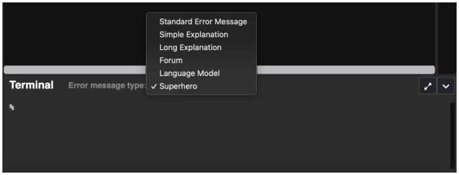

# Debugging Tips
Here are some of the most common errors you might see while writing basic Python programs. Scroll to the bottom to see a few tips for debugging buggy code.

## Common Errors 🛑

### 🛑 SyntaxError: EOL while scanning string literal 

```python
def main():
    print("Hello, world!')

if __name__ == '__main__':
    main()
```
=> Run >_ Show

Don't forget to close the quotations of your strings! Also, always make sure to be consistent when using single or double quotes. Mixing and matching will lead to this error. 


### 🛑 SyntaxError: cannot assign to literal

```python
def main():
    22 = age
 

if __name__ == '__main__':
    main()
```
=> Run >_ Show

*Remember: the variable name goes on the left side and the variable value (some expression) goes on the right.*


### 🛑 SyntaxError: invalid syntax

```python
def main()
    print("Hello, World!")
    
if __name__ == '__main__':
    main()
```
=> Run >_ Show

*This error typically means that you added something extra or forgot to add something (like a colon at the end of a function definition in the above example). If you run the code, you can see that the error message will show the exact place on the line where the invalid syntax occurs.*

### 🛑 SyntaxError: non-default argument follows default argument

```python
def repeat(s = 'cd', n):   
    repeat_str = ''
    for i in range(n):
        repeat_str += s
	
    return repeat_str


def main():
    print(repeat('heyo', 3))  
 

if __name__ == '__main__':
	main()
```
=> Run >_ Show

*Remember: default arguments (s = 'cd') must go after all non-default arguments (n) in the function definition.*


### 🛑 NameError: name '[variable name]' is not defined

```python
def main():
    print(Hello, world)

if __name__ == '__main__':
    main()
```
=> Run >_ Show

*This error occurs when you try to use a variable before you have given it a value or if you try to use a variable outside of its scope. This can also occur if you forget the quotations for a string.*


### 🛑 ZeroDivisionError: division by zero

```python
def main():
    x = 51 % 17
    y = 10
    print(y / x)


if __name__ == '__main__':
    main()
```
=> Run >_ Show

Most of the time when you see a zero division error, it's not because you explicitly wrote number / 0. Most of the time it's because you have set some variable equal to an expression that you didn't realize evaluates to 0. When you run into this error, be sure to thoroughly inspect the right side of the assignment operator to see why it evaluates to 0 (for example, it could be due to a floating point error if your code involves small numbers). Note: this error is essentially the same as:  

*ZeroDivisionError: integer division or modulo by zero*

### 🛑 TypeError: can only concatenate str (not "int/float") to str

```python
def main(): 
    x = '80' + 16.0
    print(x)

if __name__ == '__main__':
    main()
```
=> Run >_ Show

*This error occurs when you try to concatenate a string and a number. Before you can concatenate two strings or add two numbers, you have to use explicit type conversion to convert one of them to the desired type.*


### 🛑 TypeError: unsupported operand type(s) for [operator]: '[type]' and '[type]'

```python
def main():
    x = input('enter a value: ')
    print(x / 2)

if __name__ == "__main__":
    main()
```
=> Run >_ Show

This occurs when you try to do some operation between two types that can't support the given operation (for example: you can't divide a string by an int). This is similar to the error above with concatenation. Do not forget to convert types, especially when the input function is involved.


### 🛑 TypeError: 'type' object cannot be interpreted as a 'type'

```python
def count_to_num(num):
    '''
    counts up to the specified number
    params: 
        num (integer): number to count to 
    '''
    for i in range(num):
        print(i + 1)


def main():
    count_to_num('5')


if __name__ == "__main__":
    main()
```
=> Run >_ Show

*This error occurs when you try to do an operation on a variable of the wrong type. In the above example, range cannot take in a string, so passing in **'5'** as num causes an error.*


### 🛑 TypeError: '[type]' object does not support item assignment

```python
def main(): 
    names = ('Sabeen', 'Justin', 'Mukesh', 'Chen', 
             'Lucia', 'Devon', 'Yousaf', 'Aisha')
    names[4] = 'Edwin'
    print(names[4])


if __name__ == '__main__':
    main()
```
=> Run >_ Show

Don't forget: tuples and strings are immutable. This means that you cannot edit their values. If you want a container of objects that you can change, you should use a list. If you want to change the value of a string, you should build up a new string using index slicing and concatenation. 


### 🛑 ValueError: math domain error

```python
import math

def main(): 
    i = math.sqrt(-1)
    undefined = math.log(0)
    print("this can't be right")


if __name__ == '__main__':
    main()
```
=> Run >_ Show

You must pay attention to math domain rules when using the math class. Inputs to `math.sqrt()` must be non-negative. Inputs to `math.log()` must be positive. 


### 🛑 ValueError: [value] is not in list

```python
def main(): 
    colors = ["Red", "Yellow", "Orange"]
    my_color = 'Blue'
    print(colors.index(my_color))


if __name__ == '__main__':
    main()
```
=> Run >_ Show

*This error occurs when you try to grab the index of a value not in the list. Don't forget that you can always use the in keyword to check if a value is in a container before you try and access it.*


### 🛑 ValueError: not enough values to unpack (expected [], got [])

```python
def function():
    return 'hi', 3
    

def main():
    message, lucky_number, birthday = function()
    print(message)
    print('lucky_number:', lucky_number)
    print('my birthday is', birthday)
    

if __name__ == '__main__':
    main()
```
=> Run >_ Show

This error occurs when you set too many variables equal to the result of a function that returns multiple things. Remember that the number of variables should match the number of things returned (unless you want a tuple, in which case you can set one variable equal to the result). A similar error will occur if you use too few variables (any less than the number of things returned but more than one). 


### 🛑 UnboundLocalError: local variable 'var_name' referenced before assignment

```python
balance = 50.0

def deposit(amount):
    '''
    deposits the amount into the bank account (balance)
    params: 
        amount (number): amount of money to deposit
    '''
    balance += amount


def main():
    deposit(10.0)
    print(balance)
    

if __name__ == '__main__':
    main()
```
=> Run >_ Show

This is the danger of global variables! The best way to fix this error: define variables in the function that you need them, and use parameters when variables are shared between functions. Only define **constants** outside of the scope of a particular function. 


### 🛑 IndexError: [container] index out of range

```python
def main():
    names = ['Chris', 'Hannah', 'Mack', 'Ginger', 'Justin', 'Peyton', 'Elyse', 'Faith']
    print(names[8])

if __name__ == '__main__':
    main()
```
=> Run >_ Show

This error occurs when you try to access an index outside of the list (anything greater than or equal to the length of the list). You can always compare the index to the length of the list using the len function to make sure that you never access an index out of range. 


### 🛑 KeyError: [key]

```python
def main():
    grades = {'Victor': 88, 'Paola': 92, 'Ella': 92, 'Yasser': 97}
    print(grades['Cyrus'])
    

if __name__ == '__main__':
    main()
```
=> Run >_ Show

This error occurs when you try to access the value of a key that is not in the dictionary. Just like with list values, you can use the in keyword to check if a key exists in a dictionary before attempting to use it. 


## Common Bugs ⚠️
These are some common bugs that you might see in your code that aren't necessarily errors (ie won't cause an error to print to the console) but will still make your code not work the way that you want it to. 

### Bug ⚠️: incorrectly swapped variables

```python
def main():
    a = "Chris Piech"
    b = "Mehran Sahami"
    a = b		# a now points to "Mehran Sahami"
    b = a		# b still points to "Mehran Sahami"
    print(a)
    print(b)


if __name__ == '__main__':
    main()
```
=> Run >_ Show

*Fix: use a temp variable*

### Bug ⚠️: infinite loops

```python
def main():
    i = 0
    while i < 1:
        i = i - 1


if __name__ == '__main__':
    main()
```
=> Run >_ Show

This code doesn't necessarily error but it will keep running forever! We don't want that to happen. Make sure whatever condition you put in the loop is a condition that can end at some point. Most programs that you will write in this class should not take too long to run so if a program takes more than a few seconds, try checking for an infinite loop. 

### Bug ⚠️: putting code in the wrong loop (inner vs outer) 

```python
def main():
    number = 64
    while (number >= 1):
        for i in range(3):
            print("I'm going to count to three!")
            print(i+1)
        number /= 2


if __name__ == "__main__":
    main()
```
=> Run >_ Show

*If you notice that a line of code is running too frequently or infrequently in a program with nested loops, you should check which loop the code is in. Is it in the outer loop but outside the inner loop or inside both the inner and the outer loop?*

### Bug ⚠️: a function defined within a function

```python
def main():
    def func():
        print("inner function")

    print("outer function")


if __name__ == '__main__':
    main()
```
=> Run >_ Show

Remember, while this is technically valid syntax, it is better style and safer to call func in main and define it elsewhere. Also, defining a function is not the same as calling it. If you run this program, you will only see "outer function" printed to the console. 

### Bug ⚠️:  returning too early 

```python
def contains_multiple(num, start, stop):
    '''
    returns true if the given range [start, stop) has a multiple of num 
    params: 
        num: the number to check multiples of
        start: the start of the range (included)
        stop: the end of the range (not included)
    returns: 
        true if the range has a multiple and false otherwise
    '''
    for i in range(start, stop):
        if i % num != 0:
            return False
    
    return True


def main():
    print(contains_multiple(17, 48, 60))


if __name__ == '__main__':
    main()
```
=> Run >_ Show

Currently, this function returns False if the first number in the range is not a multiple of num regardless of whether or not the rest of the range contains a multiple. Here's a quick tip: since we are checking to see if our range contains at least one instance of something else, we should return True in the loop (if we find it) and False outside the loop (because that code will only be reached if the instance was never found). On the other hand, if we were trying to confirm some sort of absolute, like that the range has no instances or all instances, we would return False in the if statement in the loop (if we found a contradiction to our absolute) and True outside the loop (because code after the loop would only be reached if no contradictions were found). 

Returning too early can also happen if we try to return when we should be printing (like in a count function). 

### Bug ⚠️:  Multiple return statements side by side 

```python
def func():
    return "We love "
    return "Python"

def main():
    print(func())

if __name__ == '__main__':
    main()
```
=> Run >_ Show

Remember that each function can only return once and then the function ends. Once the first return statement executes in main, the second is ignored. We will discuss how to return multiple things in the section on Tuples. 

### Bug ⚠️: off by one 

```python
def count_to_num(num):
    '''
    counts from 1 to num
    params: num: the number to count to
    returns: the counted numbers
    '''
    for i in range(num):
        print(i)

def main():
    count_to_num(5)

if __name__ == '__main__':
    main()
```
=> Run >_ Show

If you run this code, it counts from 0 to 4 instead of 1 to 5. This is an off-by-one bug (sometimes called an off-by-one error, but we call it a bug since no error is raised). Usually, this error can be fixed by finding the line of code that outputs the number and then just adding a simple +1.

## General Tips for Debugging
Programming is typically about 50% writing code and 50% trying to fix code that you've already written, or `debugging`. Debugging can take anywhere from a few seconds to hours to fix, depending on the nature of the bug and what tricks you use to find it. Here are a few quick methods for cutting down your debugging time:

### 1. Make sure you understand the error. 
Oftentimes, when coding in the real world, programmers can get errors with descriptions that seem to have little to do with the actual bug. Fortunately, in the IDE, you have options to make errors easier to understand. 



### 2. Trace through the error's origin. 

When you get an error message, the message will often have the names of the files and functions where the errors occurred. If the error occurred in a function that was called by another function, you will see that reflected in the error output: 

```python
def error_function():
    x = 5 + '7'

def main():
    error_function()

if __name__ == '__main__':
    main()
```
=> Run >_ Show

If you run this program, you may see these 3 lines: 

```python
File "<exec>", line 13, in mainApp
File "<exec>", line 10, in main
File "<exec>", line 7, in error_function
```

This is the trace of where the errors occur in our program. The bottom line is the function where the error occurs. This is so useful when debugging. An error message can tell you what went wrong AND where to find the buggy code. 

### 3. Use print statements
Print statements can be very useful when debugging. Consider this example:

```python
def main(): 
    x = 51 % 18 * 12 - 9 / (4 ** -2)
    y = x + (-(3 * x)) - 14
    z = -y - x / 6 + (-(8 + x * 2))
    w = z / (4 + 1) * 2 % 7
    
    print('x: ' + str(x))
    print('y: ' + str(y))
    print('z: ' + str(z))
    print('w: ' + str(w))
    
    print((x + y + z + w) / (x * y * z * w))


if __name__ == '__main__':
    main()
```
=> Run >_ Show

Let's walk through this error. The error is: `ZeroDivisionError: float division by zero`. This means that in one of the four places where we divide, the denominator is 0. We could look through these five lines and calculate each denominator...

```python
x = 51 % 18 * 12 - 9 / (4 ** -2)
y = x + (-(3 * x)) - 14
z = -y - x / 6 + (-(8 + x * 2))
w = z / (4 + 1) * 2 % 7

print((x + y + z + w) / (x * y * z * w))
```

....but these statements are unnecessarily complex and evaluating them could take longer than we would like. Instead, we added print statements. If the error is in one of the variable assignments, our print statements won't run. But if you run the code and scroll to the top of the error message, you'll see our print messages. This means that the issue is in this line:

```python
print((x + y + z + w) / (x * y * z * w))
```

Specifically, the error is in the denominator of the print statement: `x * y * z * w`. Because z equals 0, the whole denominator evaluates to 0. Now, we can focus our energy on fixing z. 

Print statements are also useful for seeing how a problematic variable changes within a loop or if a line of code is even reached (like code within an if statement). 

### 4. When debugging a program with the random library, use `random.seed()`. 
Sometimes a program breaks only on certain conditions. When using the random library, sometimes, certain numbers cause errors while others don't. Using random.seed can help. Using different seeds, you can determine exactly which numbers are causing the issue so that it can be fixed. 

### 5. Test functions individually. 
These last two debugging tips should come *before you* reach a bug. They should happen while you are writing your code. Be sure to test each helper function individually and as you are writing them (i.e. before you finish the whole program). This will allow you to catch bugs early, and it will make them so much easier to find. Looking through one function for a bug is much easier than sifting through an entire program.

### 6. Test Edge Cases
Sometimes, when debugging, we can run into `edge cases`. Edge cases are instances of extreme or unexpected parameters. For example, let's say we were writing a program to give us factorials. Most numbers would follow this general pattern: 

```python
factorial(num) = num * (num - 1) * (num - 2) * ... * 1
```

This pattern says to repeatedly multiply by consecutive numbers that each decrease by 1 until you get to 1 and then stop. `factorial(1) and factorial(2)` both follow the same pattern but stop earlier than the line above `(factorial(1) = 1, factorial(2) = 2 * 1)` but what about 0? `factorial(0)` should return 1 which does not follow the pattern above. This means that 0 is an edge case. When testing, we need to make sure that passing in 0 gives back 1 and not 0 or some other number. 